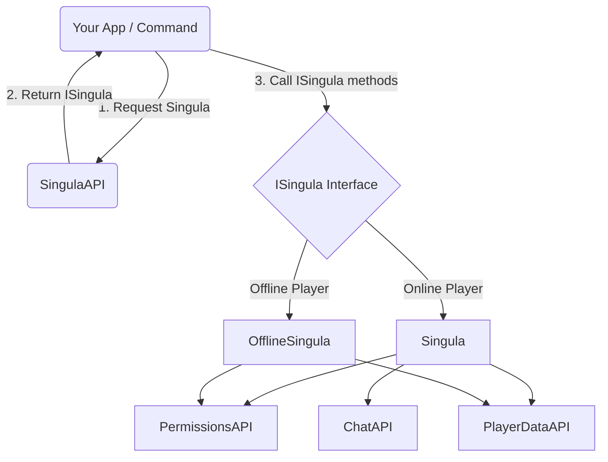

# Singula Universe

## What is Singula?
In SurvivalCore, **Singula** (Latin for "Individual") is the master wrapper for player entities. 
Instead of writing boilerplate code to fetch a player's language, then fetching their permissions from another service, and then modifying their data in a third service, you simply request the player's `ISingula` object.

Singula acts as a seamless **Facade**, abstracting away the complex interactions between `PermissionsService`, `PlayerDataService`, `ChatService`, and `LanguageService`.

## High-Level Architecture



## How to use Singula

### 1. Getting a Singula Object
To interact with a player, retrieve their Singula through the `SingulaAPI`:

```kotlin
// For an online player (Synchronous retrieval):
val singula = plugin.servicesFwk.singula.api.getSingula(player)

// For an offline player (Requires coroutine, hits Redis to verify existence):
val offlineSingula = plugin.servicesFwk.singula.api.getOfflineSingula(uuid)
```

### 2. Performing Actions
Because both online and offline representations implement `ISingula`, you can pass them around your code interchangeably for most tasks! All methods have standardized `String` and `UUID` overloads for groups to eliminate type conversions.

```kotlin
suspend fun promotePlayer(singula: ISingula, newGroup: String) {
    // 1. Give them a permission
    singula.addPermission("essentials.fly")
    
    // 2. Add them to a group
    singula.addGroup(newGroup)
    
    // 3. Get their data profile
    val data = singula.getPlayerData()
    println("${singula.username} was promoted!")
}
```

### 3. Online-Exclusive Actions
If you know the player is online (e.g. they just executed a command), you can use the concrete `Singula` object to access chat and UI features:

```kotlin
val singula = plugin.servicesFwk.singula.api.getSingula(player)

// These methods are not inside ISingula, they are exclusive to Singula!
singula.sendMessage(Component.text("Welcome back!"))
singula.showScreen(MyCustomChatScreen())
```

> [!WARNING] 
> **Folia Compatibility**
> Almost all methods in `ISingula` are `suspend` functions because they may require asynchronous Redis operations. You must call these methods from within a coroutine context. **Never use `runBlocking` in Folia.**
