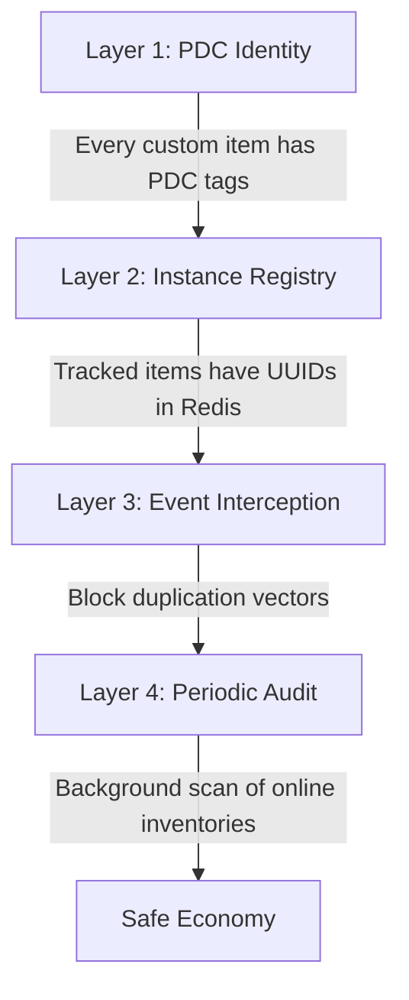

# Anti-Duplication Strategy

Duplication is the single greatest threat to a custom economy. The `CustomItem_ValidationSubservice` implements a 4-layer defense system.

## Layer 1: PDC Identity
- Custom items without valid `survivalcore:custom_item_type` tags are **not recognized** by any system.
- Players renaming a vanilla player head to "Tier 3 Diamond Extractor" will achieve nothing.

## Layer 2: Instance Registry (Tracked Items Only)
- Every high-value item (Extractors, Scanners, Modules, Analysis Maps) has `trackInstances = true`.
- They receive a unique UUID at creation, which is logged in Redis.
- If a tracked item is used, clicked, or moved, the UUID is checked against Redis.
- If the UUID is missing from Redis, the item is considered an **illegal duplicate** and is immediately destroyed.

## Layer 3: Event Interception
We aggressively intercept Bukkit events to prevent items from multiplying or escaping tracking:

| Event | Action |
|-------|--------|
| `InventoryClickEvent` | Validate items being moved; prevent moving player-bound items to public chests |
| `PlayerDropItemEvent` | Mark dropped items; track pickup |
| `EntityPickupItemEvent` | Validate picked-up items against the registry |
| `InventoryMoveItemEvent` | Block hopper/dropper movement of tracked items entirely (too risky) |
| `PlayerDeathEvent` | Track custom items in death drops to ensure they aren't cloned on respawn |
| `BlockPlaceEvent` | Prevent players from placing custom blocks (like Extractors) as vanilla blocks |

## Layer 4: Periodic Audit
- A background task periodically scans all online players' inventories.
- It counts the instances of each tracked UUID.
- If two items with the **same UUID** are found simultaneously, a duplication exploit has occurred.
- **Action:** Destroy all but the oldest copy, log the incident, and alert staff.

## Special Case: Shulker Boxes and Bundles
Nested inventories are notorious for duplication exploits. 
The system must recursively inspect the contents of Shulker Boxes and Bundles during audits and inventory events to ensure tracked items are not hidden inside them.
