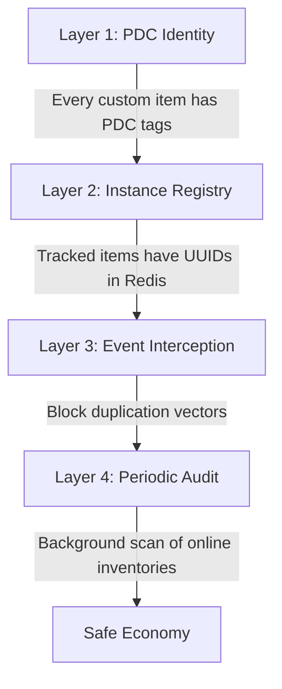

# Anti-Duplication Strategy

Duplication is the single greatest threat to a custom economy. The `CustomItem_ValidationSubservice` implements a 4-layer defense system.

## Layer 1: PDC Identity
- Custom items without valid `survivalcore:custom_item_type` tags are **not recognized** by any system.
- Players renaming a vanilla player head to "Tier 3 Diamond Extractor" will achieve nothing.

## Layer 2: Instance Registry & In-Memory Cache (Tracked Items Only)
- Every high-value item (Extractors, Scanners, Modules, Analysis Maps) has `trackInstances = true`.
- They receive a unique UUID at creation, which is logged in Redis.
- To maintain Folia thread performance, Redis is strictly mirrored by the `CustomItem_CachingSubservice`. Lookups are performed against the local cache, avoiding network latency during synchronous events.
- If a tracked item is used, clicked, or moved, the UUID is checked against the local cache.
- If the UUID is missing, the item is considered an **illegal duplicate** and is immediately destroyed.

## Layer 3: Event Interception
We aggressively intercept Bukkit events to prevent items from multiplying or escaping tracking:

| Event | Action |
|-------|--------|
| `InventoryClickEvent` | Validate items being moved; prevent moving player-bound items to public chests |
| `PlayerDropItemEvent` | Mark dropped items; track pickup |
| `EntityPickupItemEvent` | Validate picked-up items against the cache |
| `InventoryPickupItemEvent` | Prevent Hoppers/Minecart Hoppers from sucking up dropped tracked items from the ground by checking PDC tags. |
| `InventoryMoveItemEvent` | High-performance PDC tag check. If `survivalcore:custom_item_type` exists and item is marked as tracked, cancel the hopper transfer. |
| `PlayerDeathEvent` | Track custom items in death drops to ensure they aren't cloned on respawn |
| `BlockPlaceEvent` | Prevent players from placing custom blocks (like Extractors) as vanilla blocks |
| `PlayerInteractEntityEvent` | Prevent placing custom items onto Armor Stands illegally |
| `HangingPlaceEvent` / `PlayerInteractEvent` | Prevent placing custom items into Item Frames illegally |
| `BlockDispenseEvent` | Block dispensers from dispensing tracked custom items |

## Layer 4: Just-In-Time (JIT) Audit
Rather than a passive background task that only checks online players, auditing is triggered dynamically:
- **10% Audit Chance:** Every time a container (Chest, Barrel, Shulker) is opened via `InventoryOpenEvent`, there is a 10% chance its contents will be fully audited.
- **Sliding TTL Caching:** Findings from the audit (and the UUIDs encountered) are cached with a ~10-minute sliding Time-To-Live (TTL). Every time the cache is accessed or the container is opened, the 10-minute timer resets. This ensures frequently accessed containers bypass Redis verifications completely.
- **Conflict Resolution:** If the audit detects an item claiming a UUID that is currently registered in another location (or finds two identical UUIDs simultaneously), a duplication exploit has occurred.
- **Action:** Destroy all unauthorized copies, update the cache, log the incident, and alert staff.

## Special Case: Shulker Boxes and Bundles
Nested inventories are notorious for duplication exploits. 
The JIT audit system must recursively inspect the contents of Shulker Boxes and Bundles (up to a max depth of 3) during the audit chance window to ensure tracked items are not hidden inside them.
