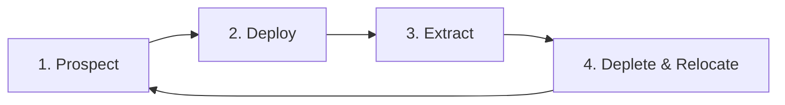

# The Gameplay Loop

The Extractor Mechanic follows a four-step cycle that drives continuous player engagement.

---

## Step 1: Prospecting (Exploration)

Players craft and use a **Geological Scanner** to discover ore-rich chunks. Scanning is an investment: scanners have limited durability, break when depleted, and must be calibrated with Material Samples before use.

**Key mechanics:**
- Scanners have tiered durability (5 to 128 uses)
- Scan depth is relative to the player's Y-level (not absolute world coordinates)
- Players must physically descend to scan deepslate-level ores with lower-tier scanners
- Scanners must be calibrated with **Material Samples** (vanilla items like Raw Iron, Diamond, Coal)
- Output: an **Analysis Result Map** containing ore density data for the scanned chunk

> See [02_scanners.md](02_scanners.md) for full scanner details.

---

## Step 2: Deployment & Fuel Economy

Once a rich chunk is found, the player places an **Extractor Core** (a custom interactive block/hologram) in that chunk and feeds it an **Analysis Result Map** from that same chunk.

**Key mechanics:**
- The Extractor requires an **Analysis Result Map** from the same chunk to know what it can mine
- **Map Consumption:** The map is consumed the moment it is placed inside an extractor and cannot be used twice. It remains stuck in the extractor until replaced.
- **Multiple Extractors:** Any amount of extractors can be placed in the same chunk (even by different players), but they are not smart and will collide/compete for the same blocks.
- Extractors are fueled exclusively by **Compact Coal Blocks**
- This creates an interconnected economy: coal extractors fuel higher-value extractors
- The Extractor GUI (via `InventoryGUIService`) manages the map slot, fuel, storage, and upgrade modules

> See [03_extractors.md](03_extractors.md) for full extractor details.

---

## Step 3: Physical Extraction

While fueled and active, the Extractor runs on a **cooldown cycle** driven by the Folia Region Scheduler.

**Key mechanics:**
- The extractor operates on a repeating cooldown: it enters cooldown ("mining"), then attempts to break a real ore block in the chunk
- **If a valid block is found:** the block is **physically broken**, replaced with Cobblestone (stone-level) or Cobbled Deepslate (deepslate-level), items are deposited into the extractor's internal inventory, and the cooldown resets
- **If no valid block is found:** the cooldown resets anyway (the extractor "swings and misses")
- Over time, massive veins of cobblestone cut through the earth — a permanent visual scar of industrial depletion
- **Offline/unloaded behavior:** while the chunk is unloaded, the cooldown timer is **longer** than the loaded cooldown, and the items gained are limited by the real number of ore blocks the extractor manages to find — this naturally throttles offline gains without needing an artificial cap

---

## Step 4: Depletion and Relocation

Eventually, the chunk runs dry of the targeted material.

**Key mechanics:**
- The Extractor GUI shows "Resources Depleted"
- The player must pack up their machinery
- Refuel their scanner and venture deeper into the world
- Find a new chunk to continue the cycle

**Why this matters:** This solves the "endgame stagnation" problem by forcing players to continually explore, preventing infinite AFK resource generation from a single location.
