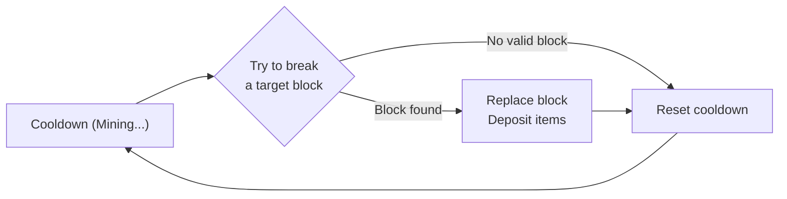

# Extractor Cores

Extractors are the heart of the mechanic — heavy machinery that physically mines blocks from the world over time.

---

## Core Concepts

- Extractors are **material-specific** (e.g., Diamond Extractor, Coal Extractor)
- Each type can be upgraded through **5 tiers**
- Extractors require an **Analysis Result Map** to operate (see [02_scanners.md](02_scanners.md))
- Extractors are fueled exclusively by **Compact Coal Blocks**
- **Map Consumption:** Analysis Maps are consumed upon insertion into the GUI and remain stuck until replaced.
- **Maximum extractors per player:** Default limit is 4 (higher limits may be implemented via custom level systems later)

---

## Physical Representation

### In the Player's Inventory

The extractor is a **custom player head** item with a unique skin (similar to Hypixel Skyblock's minions). Each material type and tier has a distinct head skin.

### In the World (Placed)

When placed on the ground, the extractor head **builds a small controlled structure** (~3×3×5 blocks). This structure:

- Is composed of real blocks that form the machine's physical presence
- May use **particles, armor stands, and/or holograms** for visual effects and animations (exact visuals TBD)
- **Cannot be broken normally** — the blocks that compose it will re-appear if broken
- However, **breaking its blocks deals virtual damage** to the extractor's health pool

### Placement Requirements

- Place the head item on the floor (ground level)
- Must have **enough space** for the 3×3×5 structure to build
- Must **not be too close to a chunk border** (the extractor must belong to exactly one chunk)
- The extractor is bound to the chunk it's placed in

### Picking Up (Disassembly)

- Extractors are **NOT picked up by breaking them**
- The Extractor GUI contains a **"Disassembly" button** that safely packs the extractor back into an item
- If the extractor is damaged (health < max), disassembly is **blocked** — the GUI shows: *"Moving the extractor in these conditions would completely destroy it."*
- The extractor must be **fully repaired** before it can be relocated

---

## Tier Specifications

| Tier | Scope | Key Traits |
|------|-------|------------|
| **I** | Overworld | Entry-level. Slow, noisy, high infestation risk |
| **II** | Overworld | Moderate speed improvement |
| **III** | Overworld | Significantly faster, quieter, reduced infestation risk |
| **IV** | Overworld (Endgame) | Can mine ~10 blocks above its Y-level. Capable of very slowly mining netherite from the overworld |
| **V** | Nether-exclusive | Required for harvesting advanced nether resources natively |

### Tier Scaling Properties

- **Speed:** Higher tiers have shorter extraction cooldowns
- **Capacity:** Higher tiers hold more items in storage
- **Noise/Heat:** Higher tiers run cooler and quieter, naturally reducing infestation risk
- **Material Risk:** Rare materials inherently generate more noise. A Tier I Diamond Extractor creates massive heat compared to a Tier I Coal Extractor. Upgrading to Tier III is crucial to *reduce* that noise

### Crafting Cost Philosophy

Crafting an extractor requires massive amounts of the material it mines.

**Example:** A Diamond Extractor requires **Compact Diamond Blocks** (where 1 Compact Block = 9 Vanilla Diamond Blocks = 81 Diamonds).

Higher-tier extractors are crafted **from the previous tier** — a Tier V inherits all components from Tier I through IV. This matters for repair costs (see [Repair System](#repair-system)).

---

## Extraction Cycle

The extractor operates on a **cooldown-based cycle**, not a continuous stream:



1. **Cooldown phase:** The extractor is "mining" — the player sees a progress indicator
2. **Extraction attempt:** When the cooldown ends, the extractor scans the chunk for a valid target block (matching the Analysis Map materials and Y-range)
3. **Success:** The block is physically replaced (Cobblestone or Cobbled Deepslate), the items are deposited into the extractor's storage, and the cooldown resets
4. **Failure:** If no valid block is found (chunk depleting), the cooldown resets anyway — the machine keeps searching but finds nothing

### Offline / Unloaded Behavior

When the extractor's chunk is **not loaded**:

- The extraction cooldown is **longer** than the normal "loaded" cooldown (reduced efficiency while offline)
- The items gained are **limited by the real number of ore blocks** the extractor manages to find in the chunk — it still physically checks and replaces blocks
- Upon chunk load, the extractor simulates the elapsed time using the slower offline cooldown rate
- This naturally throttles offline extraction: slower speed + finite real blocks = no infinite AFK exploits

---

## Fuel Economy

All extractors run on **Compact Coal Blocks** (81 Coal per block).

This creates an interconnected resource economy:
- Players need **Coal Extractors** to generate fuel for their higher-tier operations
- Diamond/Emerald/Gold extractors consume fuel far faster than coal extractors produce it
- Players must balance their fleet of extractors to maintain fuel supply

---

## Block Replacement Behavior

When a block is extracted:

| Original Block Level | Replacement |
|---------------------|-------------|
| Stone-level ore (Y > 0) | Cobblestone |
| Deepslate-level ore (Y ≤ 0) | Cobbled Deepslate |

This creates a permanent visual scar — massive veins of unnatural cobblestone cutting through the earth where ore used to be.

---

## Upgrade Modules

Players can slot tiered modules into the Extractor GUI to customize behavior:

| Module | Tiers | Effect | Trade-off |
|--------|-------|--------|-----------|
| **Drill Speed** | I, II | Reduces extraction cooldown | Reduces fuel efficiency |
| **Fortune** | I, II | % chance to double ore drops | — |
| **Furnace** | — | Smelts materials (Iron, Copper, Gold only) | Consumes more fuel |
| **Compactor** | — | Converts items into block variants (e.g., 9 Iron Ingots → Iron Block) | Requires Furnace module for Iron/Copper/Gold extractors |
| **Super Compactor** | — | Converts blocks into Compact Blocks (e.g., 9 Iron Blocks → Compact Iron Block) | Requires Compactor module |
| **Storage** | I, II | Unlocks more storage space | — |
| **Remote Monitor** | I, II | Sends notifications to the owner about extractor events | — |

### Module Details

#### Furnace + Compactor Pipeline

The Furnace → Compactor dependency exists because **raw ores cannot be compacted directly**. The processing pipeline is:

```
Mine Raw Iron → [Furnace Module] → Iron Ingot → [Compactor] → Iron Block → [Super Compactor] → Compact Iron Block
```

For materials that don't need smelting (Diamond, Coal, Lapis, Redstone, Emerald):
```
Mine Diamond → [Compactor] → Diamond Block → [Super Compactor] → Compact Diamond Block
```

- The **Compactor** requires the **Furnace module** only on extractors that support smelting (Iron, Copper, Gold) — because the raw ore must be smelted into ingots before it can be compacted into blocks
- The **Super Compactor** always requires the **Compactor** module as a prerequisite

#### Remote Monitor Module

| Tier | Features |
|------|----------|
| **I** | Sends **chat notifications** to the owner (if online, any distance) for critical events: fuel depleted, under siege, damaged, destroyed, resources depleted |
| **II** | All Tier I features + **periodic status reports** (storage capacity, fuel remaining) + **early infestation warnings** before a siege begins |

This solves the "extractor 5000 blocks away" problem — players don't need to physically visit their machines to know what's happening.

### Module Gating

- **Drill Speed II:** Heavily gated by Compact Gold/Redstone blocks
- **Fortune II:** Requires Compact Lapis and Compact Emerald blocks
- **Compactor:** Requires Furnace module if the extractor type supports smelting
- **Super Compactor:** Always requires Compactor module
- **Remote Monitor II:** Requires Compact Redstone and Ender Eyes

---

## Extractor GUI Layout

The Extractor is managed through an `InventoryGUIService`-based GUI containing:

1. **Map Slot** — Insert the Analysis Result Map
2. **Fuel Slot(s)** — Insert Compact Coal Blocks
3. **Module Slots** — Insert upgrade modules
4. **Storage Area** — Extracted items accumulate here
5. **Status Indicator** — Shows operational state (Active / Out of Fuel / Depleted / Damaged)
6. **Disassembly Button** — Packs the extractor back into an item (blocked if damaged)
7. **Info Icon** — Shows extractor tier, type, health, fuel level, and extraction progress

---

## Repair System

When an extractor takes damage (from infestation mobs breaking its blocks or from a siege):

### Damage Levels & Repair Costs

Repair always requires a **Repair Kit** plus **crafting parts** proportional to the damage:

| Damage Level | Required Parts |
|--------------|---------------|
| **Light** (~75-99% health) | Repair Kit only |
| **Moderate** (~50-74% health) | Repair Kit + Tier I extractor materials |
| **Heavy** (~25-49% health) | Repair Kit + Tier I-II extractor materials |
| **Critical** (~1-24% health) | Repair Kit + Tier III+ extractor materials |
| **Destroyed** (0% health) | Repair Kit + materials up to the extractor's own tier |

Since a **Tier V extractor inherits components from all previous tiers** (I → II → III → IV → V), a destroyed Tier V extractor may require parts spanning all 5 tiers — making it extremely expensive to repair.

### Repair Rules

- **Damaged extractors cannot be disassembled** — the GUI shows: *"Moving the extractor in these conditions would completely destroy it."*
- The extractor must be **fully repaired** before it can be picked up and relocated
- Repair is performed through the Extractor GUI (a "Repair" interface that shows required materials)
- The extractor continues to function at reduced capacity while damaged (TBD: reduced speed? increased heat?)

---

## Crafting Recipes

> See [05_crafting_reference.md](05_crafting_reference.md#c-extractor-cores) for full recipes.
> See [05_crafting_reference.md](05_crafting_reference.md#d-extractor-modules) for module recipes.
