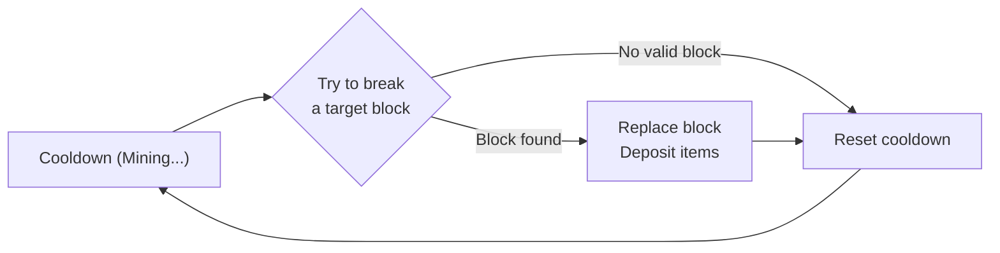

# Extractor Cores

Extractors are the heart of the mechanic — heavy machinery that physically mines blocks from the world over time.

---

## Core Concepts

- Extractors are **material-specific** (e.g., Diamond Extractor, Coal Extractor)
- Each type can be upgraded through **5 tiers**
- Extractors require an **Analysis Result Map** to operate (see [02_scanners.md](02_scanners.md))
- Extractors are fueled exclusively by **Compact Coal Blocks**
- **Map Consumption:** Analysis Maps are consumed upon insertion into the GUI and remain stuck until replaced.
- **Maximum extractors per player:** Default limit is 4 (higher limits may be implemented via custom level systems later)

---

## Physical Representation

### In the Player's Inventory

The extractor is a **custom player head** item with a unique skin (similar to Hypixel Skyblock's minions). Each material type and tier has a distinct head skin.

### In the World (Placed)

When placed on the ground, the extractor head **builds a small controlled structure** (~3×3×5 blocks). This structure:

- Is composed of real blocks that form the machine's physical presence
- May use **particles, armor stands, and/or holograms** for visual effects and animations (exact visuals TBD)
- Breaking its blocks deals virtual damage to the extractor's health pool and the blocks are **immediately replaced**

#### Access Control

- **Only the owner** can open the Extractor GUI via right-click
- **Any player** can physically break the extractor's structure blocks — this deals damage to the health pool and those blocks are immediately replaced
- Non-owners attempting to open the GUI receive a denial message: *"This machine belongs to [owner]."*
- A future **trust system** may allow owners to grant GUI access to teammates (e.g., `/extractor trust <player>`)

#### Structure Protection

The 3×3×5 footprint is actively protected against all forms of environmental and player interference:

| Threat | Behavior |
|--------|----------|
| Block break (any player) | Break is cancelled; damage applied to health pool; block replaced immediately |
| Piston push | Cancelled — structure blocks cannot be moved by pistons |
| Explosion (TNT, creeper, ghast, etc.) | Damage applied to health pool proportionally; all broken blocks replaced |
| Fluid flow (lava, water) | Blocked — fluid cannot enter the structure footprint |
| Block placement inside footprint | Only the owner may place blocks inside the 3×3×5 area |
| Chunk reload / server restart | On chunk load, all structure blocks are validated and re-placed if missing |

All structure block locations are tracked in a **server-side registry** (in-memory + Redis) mapping block coordinates → extractor UUID. This registry is the authoritative source for damage routing and protection checks.

### Placement Requirements

- Place the head item on the floor (ground level)
- Must have **enough space** for the 3×3×5 structure to build
- Must **not be too close to a chunk border** (the extractor must belong to exactly one chunk)
- The extractor is bound to the chunk it's placed in

### Picking Up (Disassembly)

- Extractors are **NOT picked up by breaking them**
- The Extractor GUI contains a **"Disassembly" button** (blocked if extractor is damaged)
- The extractor must be **fully repaired** before it can be disassembled
- When triggered, the extractor plays a **disassembly animation** — the reverse of the build sequence. Structure blocks disappear layer by layer from the cap downward, with particles and mechanical sounds, over approximately 3–5 seconds
- When the animation completes, **all installed modules AND the Extractor Core item are dropped at the extractor's location** as physical item entities — nothing goes directly to the player's inventory
- The player must physically walk over and collect the dropped items

> This is intentional. The dropped-item ceremony makes disassembly feel weighty and real, matches the visual spectacle of the build animation, and prevents accidentally teleporting expensive machines into inventory.

---

## Tier Specifications

| Tier | Scope | Key Traits |
|------|-------|------------|
| **I** | Overworld | Entry-level. Slow, noisy, high infestation risk |
| **II** | Overworld | Moderate speed improvement |
| **III** | Overworld | Significantly faster, quieter, reduced infestation risk |
| **IV** | Overworld (Endgame) | Can mine ~10 blocks above its Y-level. Capable of very slowly mining netherite from the overworld |
| **V** | Nether-exclusive | Required for harvesting advanced nether resources natively |

### Tier Scaling Properties

| Property | Tier I | Tier II | Tier III | Tier IV | Tier V |
|----------|--------|---------|----------|---------|--------|
| Health | 100 HP | 200 HP | 400 HP | 800 HP | 1,600 HP |
| Module Slots | **2** | **3** | **3** | **4** | **5** |

- **Speed:** Higher tiers have shorter extraction cooldowns
- **Capacity:** Higher tiers hold more items in storage
- **Noise/Heat:** Higher tiers run cooler and quieter, naturally reducing infestation risk
- **Material Risk:** Rare materials inherently generate more noise. A Tier I Diamond Extractor creates massive heat compared to a Tier I Coal Extractor. Upgrading to Tier III is crucial to *reduce* that noise

### Crafting Cost Philosophy

Crafting an extractor requires massive amounts of the material it mines.

**Example:** A Diamond Extractor requires **Compact Diamond Blocks** (where 1 Compact Block = 9 Vanilla Diamond Blocks = 81 Diamonds).

Higher-tier extractors are crafted **from the previous tier** — a Tier V inherits all components from Tier I through IV. This matters for repair costs (see [Repair System](#repair-system)).

---

## Structure Blueprint

The extractor's 3×3×5 structure uses the **extractor's own crafting materials** as its primary visual language. All tiers share the same spatial layout but escalate dramatically in material quality, ensuring Tier IV/V machines feel unmistakably more imposing.

### Spatial Layout (all tiers)

```
Y=4 (Cap):    [C][T][C]     T = Top-cap centerpiece  C = Corner cap block
              [T][T][T]
              [C][T][C]

Y=3 (Body):   [P][ ][P]     P = Pillar block
              [ ][K][ ]     K = Core block (material's compact/base block)
              [P][ ][P]     (space) = open air

Y=2 (Body):   [P][A][P]     A = Accent block
              [A][K][A]
              [P][A][P]

Y=1 (Body):   [P][ ][P]
              [ ][K][ ]
              [P][ ][P]

Y=0 (Base):   [B][B][B]     B = Base plate block
              [B][B][B]
              [B][B][B]
```

The player-head custom item hovers above the cap as the hologram anchor point.

### Material Assignment by Tier

| Layer | Tier I | Tier II | Tier III | Tier IV | Tier V |
|-------|--------|---------|----------|---------|--------|
| **Base (B)** | Stone Bricks | Stone Bricks | Polished Deepslate | Obsidian | Crying Obsidian |
| **Pillars (P)** | Iron Blocks | Iron Blocks | Deepslate Bricks | Chiseled Deepslate | Netherite Blocks |
| **Accents (A)** | *(open air)* | Smooth Stone | Polished Deepslate | Crying Obsidian | Blackstone Bricks |
| **Core (K)** | Material's base block* | Material's base block* | Material's compact block† | Material's compact block† | Material's compact block† |
| **Cap center (T)** | Blast Furnace (up) | Blast Furnace (up) | Blast Furnace (up) | Blast Furnace (up) | **Beacon** |
| **Cap corners (C)** | Cobblestone | Stone Bricks | Deepslate Tiles | Chiseled Deepslate | Gold Blocks |

\*Base block example: Coal Block for Coal Extractor, Iron Block for Iron Extractor  
†Compact block example: Compact Diamond Block for Diamond Extractor (9 Diamond Blocks compressed)

### Visual Identity Notes

- **Tier I–II** — Rough, utilitarian. A cobblestone-and-iron machine you build early and replace. Recognizable, not impressive.
- **Tier III** — Polished Deepslate gives it a professional, refined look. Feels like real industrial equipment.
- **Tier IV** — Obsidian base + Crying Obsidian accents create a dark, threatening silhouette. The deep purple glow sets it apart immediately.
- **Tier V** — The **Beacon** at the cap fires its beam skyward (using particles to simulate the effect). A Tier V extractor announces its presence to everyone within render distance. This is intentional — a machine worth this much should *look* that powerful.

### Material-Specific Core Color

Since the core column (K) uses the material's own block, two extractors of the same tier look visually distinct by material:

| Material | Core Appearance |
|----------|----------------|
| Coal | Black column |
| Iron | Silver/white column |
| Gold | Gold column |
| Diamond | Aqua/teal column |
| Emerald | Green column |
| Redstone | Red-speckled column |
| Lapis | Deep blue column |
| Quartz | White column |
| Ancient Debris | Dark gray/brown column (Tier V only) |


The extractor operates on a **cooldown-based cycle**, not a continuous stream:



1. **Cooldown phase:** The extractor is "mining" — the player sees a progress indicator
2. **Extraction attempt:** When the cooldown ends, the extractor scans the chunk for a valid target block (matching the Analysis Map materials and Y-range)
3. **Success:** The block is physically replaced (Cobblestone or Cobbled Deepslate), the items are deposited into the extractor's storage, and the cooldown resets
4. **Failure:** If no valid block is found (chunk depleting), the cooldown resets anyway — the machine keeps searching but finds nothing

### Offline / Unloaded Behavior

When the extractor's chunk is **not loaded**:

- The extraction cooldown is **longer** than the normal "loaded" cooldown (reduced efficiency while offline)
- The items gained are **limited by the real number of ore blocks** the extractor manages to find in the chunk — it still physically checks and replaces blocks
- Upon chunk load, the extractor simulates the elapsed time using the slower offline cooldown rate
- Fuel consumption, storage capacity, and mid-catchup fuel depletion are all accounted for (see [06_technical_architecture.md — Catchup Algorithm](06_technical_architecture.md))
- This naturally throttles offline extraction: slower speed + finite real blocks + capped storage = no infinite AFK exploits

---

## Block Locking (Race Condition Prevention)

When multiple extractors target the same chunk and ore type, a **block locking system** prevents race conditions and double-mining exploits.

### Rules

1. When an extractor begins its extraction attempt, it scans the chunk for a valid, **unlocked** target block
2. If a valid block is found, the extractor **atomically locks it** — no other extractor may target this block
3. A block is only considered **successfully mined** when it has been **detected AND physically replaced in the same tick**
4. If detection or replacement fails (e.g., the block was already replaced by a concurrent extractor), the attempt is discarded and the cooldown resets — no items are awarded
5. Locks are **held only for the duration of the extraction tick** and released immediately after (success or fail)
6. If a block is already locked, the extractor skips it and picks the next available unlocked block in the chunk

### Implementation Note

Block locks are managed by `Extractor_MiningSubservice` via an in-memory `ConcurrentHashMap<BlockKey, UUID>` (block location → extractor UUID). Since Folia executes block operations on the correct region thread, all lock operations within the same region are naturally serialized — no additional synchronization is needed beyond using a thread-safe map.

> ⚠️ **No block is ever credited as "mined" unless detection and replacement occur atomically in the same tick.** This eliminates all double-drop exploits from multi-extractor chunk competition.

---

## Fuel Economy

All extractors run on **Compact Coal Blocks** (81 Coal per block).

This creates an interconnected resource economy:
- Players need **Coal Extractors** to generate fuel for their higher-tier operations
- Diamond/Emerald/Gold extractors consume fuel far faster than coal extractors produce it
- Players must balance their fleet of extractors to maintain fuel supply

---

## Block Replacement Behavior

When a block is extracted, it is replaced with a contextual filler block based on dimension and biome.

### Overworld Rules

| Original Block | Replacement |
|----------------|-------------|
| Stone-level ore (Y > 0) | Cobblestone |
| Deepslate-level ore (Y ≤ 0) | Cobbled Deepslate |

Overworld extraction leaves **permanent, obvious visual scars** — unnatural veins of cobblestone cutting through otherwise natural terrain. These scars are landmarks: any player exploring the area can immediately see that an extractor operated here.

### Nether Rules

Nether replacement uses the **native biome material** instead of a single universal filler:

| Nether Biome | Replacement Block |
|--------------|------------------|
| Nether Wastes | Netherrack |
| Basalt Deltas | Blackstone |
| Crimson Forest | Netherrack |
| Warped Forest | Netherrack |
| Soul Sand Valley (Y ≥ 35) | Soul Sand |
| Soul Sand Valley (Y < 35) | Netherrack |

Biome is determined at runtime with a single `block.getBiome()` call during the replacement step.

### The Asymmetry

This creates a deliberate thematic contrast between the two dimensions:

> **Overworld operations are landmarks. Nether operations are ghost runs.**

- Cobblestone scars in the Overworld are highly visible and tell a story: someone was here, and they extracted heavily.
- Biome-native replacement in the Nether leaves **no visible trace** — a mined chunk looks identical to an unmined one. Nether extraction is stealthy by nature.

This asymmetry has interesting emergent implications for PvP servers: rival players can scout Overworld sites for evidence of extraction activity, but Nether operations remain invisible.

---

## Upgrade Modules

Players can slot tiered modules into the Extractor GUI to customize behavior:

| Module | Tiers | Effect | Trade-off |
|--------|-------|--------|-----------|
| **Drill Speed** | I, II | Reduces extraction cooldown | Reduces fuel efficiency |
| **Fortune** | I, II | % chance to double ore drops | — |
| **Furnace** | — | Smelts materials (Iron, Copper, Gold only) | Consumes more fuel |
| **Compactor** | — | Converts items into block variants (e.g., 9 Iron Ingots → Iron Block) | Requires Furnace module for Iron/Copper/Gold extractors |
| **Super Compactor** | — | Converts blocks into Compact Blocks (e.g., 9 Iron Blocks → Compact Iron Block) | Requires Compactor module |
| **Storage** | I, II | Unlocks more storage space | — |
| **Remote Monitor** | I, II | Sends notifications to the owner about extractor events | — |

### Module Slot Count by Tier

| Tier | Slots | Design Intent |
|------|-------|---------------|
| **I** | 2 | Forces hard early choices — pick two, sacrifice everything else |
| **II** | 3 | One extra slot — enough to start a processing chain or add monitoring |
| **III** | 3 | Same count as II — tier upgrade buys efficiency, not new slots |
| **IV** | 4 | Significant jump — the reward for reaching endgame |
| **V** | 5 | Full module complement — the only tier that can run everything simultaneously |

### Module Dependencies & Incompatibilities

| Rule | Modules Affected |
|------|------------------|
| **Compactor requires Furnace** | Only on extractors that produce raw ores (Iron, Copper, Gold) — ore must be smelted to ingot before compaction |
| **Super Compactor requires Compactor** | Always, regardless of material type |
| **Drill Speed I / II are mutually exclusive** | Only one tier can be installed at a time |
| **Fortune I / II are mutually exclusive** | Only one tier can be installed at a time |
| **Storage I / II are mutually exclusive** | Only one tier can be installed at a time |
| **Remote Monitor I / II are mutually exclusive** | Only one tier can be installed at a time |

Attempting to insert an incompatible module shows a GUI error: *"Requires [Module Name] first."* or *"Conflicts with installed [Module Name]."*

### Module Details

#### Furnace + Compactor Pipeline

The Furnace → Compactor dependency exists because **raw ores cannot be compacted directly**. The processing pipeline is:

```
Mine Raw Iron → [Furnace Module] → Iron Ingot → [Compactor] → Iron Block → [Super Compactor] → Compact Iron Block
```

For materials that don't need smelting (Diamond, Coal, Lapis, Redstone, Emerald):
```
Mine Diamond → [Compactor] → Diamond Block → [Super Compactor] → Compact Diamond Block
```

- The **Compactor** requires the **Furnace module** only on extractors that support smelting (Iron, Copper, Gold) — because the raw ore must be smelted into ingots before it can be compacted into blocks
- The **Super Compactor** always requires the **Compactor** module as a prerequisite

#### Fortune Module

The Fortune module uses a **probabilistic multiplier**, mirroring vanilla Minecraft's Fortune enchantment, rather than a guaranteed flat multiplier. This creates exciting variance where an extractor might occasionally yield a massive burst of items in a single cycle.

- **Fortune I:** 50% chance of 1 bonus drop (averages to 1.5× yield over time)
- **Fortune II:** 50% chance of 1 bonus drop + 25% chance of a second bonus drop (averages to ~2.0× yield over time)

#### Remote Monitor Module

| Tier | Features |
|------|----------|
| **I** | Sends **chat notifications** to the owner (if online, any distance) for critical events: fuel depleted, under siege, damaged, destroyed, resources depleted |
| **II** | All Tier I features + **periodic status reports** (storage capacity, fuel remaining) + **early infestation warnings** before a siege begins |

This solves the "extractor 5000 blocks away" problem — players don't need to physically visit their machines to know what's happening.

### Module Gating

- **Drill Speed II:** Heavily gated by Compact Gold/Redstone blocks
- **Fortune II:** Requires Compact Lapis and Compact Emerald blocks
- **Compactor:** Requires Furnace module if the extractor type supports smelting
- **Super Compactor:** Always requires Compactor module
- **Remote Monitor II:** Requires Compact Redstone and Ender Eyes

---

## Extractor GUI Layout

The Extractor is managed through an `InventoryGUIService`-based GUI containing:

1. **Map Slot** — Insert the Analysis Result Map
2. **Fuel Slot(s)** — Insert Compact Coal Blocks
3. **Module Slots** — **Varies by tier** (2 / 3 / 3 / 4 / 5 slots for Tier I through V). Slots accept any module type; dependency and incompatibility rules are enforced on insertion
4. **Storage Area** — Extracted items accumulate here
5. **Status Indicator** — Shows operational state (Active / Out of Fuel / Depleted / Damaged)
6. **Disassembly Button** — Packs the extractor back into an item (blocked if damaged)
7. **Info Icon** — Shows extractor tier, type, health, fuel level, and extraction progress
8. **Heat Meter** — A colored glass pane (color changes with threat level) showing the raw heat value, breakdown by component, and a **thematic threat descriptor** in place of a clock-based frequency:

| Heat Range | Glass Color | Threat Descriptor |
|------------|-------------|-------------------|
| 0–10 | Lime Glass | *"Barely a whisper."* |
| 11–25 | Yellow Glass | *"Distant rumbling."* |
| 26–40 | Orange Glass | *"Something stirs nearby."* |
| 41–60 | Red Glass | *"The earth trembles with rage."* |
| 61–80 | Purple Glass | *"An overwhelming presence approaches."* |
| 81–100 | Magenta Glass | *"Everything wants you dead."* |

The hover lore shows: current heat value, per-component breakdown (material base + tier modifier + active modules), and the descriptor. No clock times.

---

## Visual & Audio Feedback

The extractor's appearance and sound **scale directly with its heat level**, giving players an instant read of how dangerous the current setup is — no need to open the GUI.

### Operational States

| State | Trigger |
|-------|---------|
| **Idle** | Placed but missing map, fuel, or both |
| **Active** | Fueled and running — cooldown cycling |
| **Depleted** | No valid ore blocks remain |
| **Damaged** | Health below 50% |
| **Under Siege** | Infestation event in progress |
| **Destroyed** | Health at 0 — machine offline |

### Particle System by Heat Level

All particles emit from the top of the 3×3×5 structure, distributed randomly across the footprint.

| Heat Range | Particle Types | Update Rate |
|------------|---------------|-------------|
| **0–10 Safe** | `SMOKE_NORMAL` ×1 | Every 40 ticks |
| **11–25 Low** | `SMOKE_NORMAL` ×2, occasional `FLAME` ×1 | Every 30 ticks |
| **26–40 Moderate** | `SMOKE_LARGE` ×3, `FLAME` ×2 | Every 20 ticks |
| **41–60 Dangerous** | `SMOKE_LARGE` ×5, `FLAME` ×4, `LAVA` ×1 | Every 15 ticks |
| **61–80 Extreme** | `FLAME` ×6, `LAVA` ×3, `SMOKE_LARGE` ×3 | Every 10 ticks |
| **81–100 Suicidal** | `FLAME` ×8, `LAVA` ×5, `SMOKE_LARGE` ×4, `SOUL_FIRE_FLAME` ×2 | Every 8 ticks |

### State-Specific Effects

| Event | Particles | Sound |
|-------|-----------|-------|
| **Extraction success** | `CRIT` burst + `BLOCK_CRACK` of the mined ore type | `BLOCK_ANVIL_USE` at random pitch (0.9–1.3) |
| **Fuel depleted** | `SMOKE_LARGE` burst, then idle silence | `ENTITY_VILLAGER_NO` + `BLOCK_FIRE_EXTINGUISH` |
| **Siege warning** (30s prior) | Rapid `REDSTONE` red flashes pulsing outward | `ENTITY_ENDERMAN_STARE` ×3 |
| **Mob strikes extractor** | `CRIT_MAGIC` sparks at hit location | `ENTITY_IRON_GOLEM_DAMAGE` |
| **Extractor destroyed** | `EXPLOSION_LARGE` + `SMOKE_LARGE` cloud | `ENTITY_GENERIC_EXPLODE` + `BLOCK_ANVIL_BREAK` |
| **Repair completed** | `VILLAGER_HAPPY` particle burst | `ENTITY_PLAYER_LEVELUP` |

### Active Sound Loop

While in Active state, the extractor plays a looping ambient sound scaled to heat:

| Heat Range | Sound | Pitch | Period |
|------------|-------|-------|--------|
| **0–25** | `BLOCK_STONE_BUTTON_CLICK_ON` | 0.5 | Every 80 ticks |
| **26–40** | `BLOCK_PISTON_EXTEND` | 0.8 | Every 40 ticks |
| **41–60** | `ENTITY_IRON_GOLEM_STEP` | 0.6 | Every 25 ticks |
| **61+** | `ENTITY_BLAZE_AMBIENT` | 1.0 | Every 15 ticks |

Sounds play at the extractor location and are audible at standard Minecraft range. A player standing nearby can *hear* how hot their machine is running.

### Hologram Display

An invisible **Text Display entity** (or armor stand nametag on older API) is placed 2 blocks above the extractor center. It updates every **20 ticks (1 second)** and shows:

```
§b[Diamond Extractor — Tier III]
§a● ACTIVE
Heat:  §c🔥🔥🔥§7○○  (30/100)
Fuel:  §a▓▓▓▓▓▓§7░░  72%
Items: §e▓▓▓§7░░░░░  18/54
```

**Color rules:**
- Status line: `§a● ACTIVE` (green) / `§c● DAMAGED` (red) / `§e⚠ UNDER SIEGE` (gold, flashing) / `§7● IDLE` (gray) / `§8● DEPLETED` (dark gray)
- Fuel bar: `§a` green above 50%, `§e` yellow 25–50%, `§c` red below 25%
- Storage bar: same thresholds as fuel
- Heat fire icons fill left-to-right, coloring from `§7` (empty/cool) to `§c` (filled/hot)

The hologram is visible to **all players within 16 blocks**. The owner sees all lines; non-owners see only the status line and heat indicator.

When an extractor takes damage (from infestation mobs breaking its blocks or from a siege):

### Damage Levels & Repair Costs

Repair cost scales with damage severity, split into two clear tiers:

| Health Remaining | Damage Level | Required Materials |
|-----------------|-------------|-------------------|
| **50–99%** | Light | **Repair Kits only** — `ceil(damage% ÷ 10)` kits |
| **1–49%** | Heavy | **Repair Kits** (`ceil(damage% ÷ 5)`) **+ exact crafting components** of the extractor's own tier, in amounts of `ceil(damage% ÷ 25)` sets |
| **0%** | Destroyed | **Full Reconstruction** (one set of materials per tier from I through the extractor's tier, plus 20 Repair Kits) — OR salvage as a **Degraded Core** |

**"Exact crafting components"** means the specific items from the extractor's recipe — not an abstract "material set". For example, a Tier III Diamond Extractor at 20% health (80% damage) would require: 16 Repair Kits + 4× [Compact Diamond Block, Nether Star, Iron Block]. The exact item list is derived from the recipe registry at runtime.

> **Repair cost cap:** The required amount of any individual ingredient can never exceed the quantity of that ingredient used in crafting the extractor. A machine cannot cost more to repair than it cost to build.

> **Degraded Core:** A salvaged core cannot be placed directly. It must be combined with Tier I extractor materials at a crafting table to restore it to a functional Tier I state — cheaper than full reconstruction but loses all upgrades above Tier I.

Since higher-tier extractors inherit components from all previous tiers (I → II → III → IV → V), full reconstruction of a destroyed Tier V extractor demands parts spanning all 5 tiers — making prevention and active defense critical.

### Repair Rules

- **Damaged extractors cannot be disassembled** — the GUI shows: *"Moving the extractor in these conditions would completely destroy it."*
- The extractor must be **fully repaired** before it can be picked up and relocated
- Repair is performed through the Extractor GUI via a **"Repair" tab** that shows:
  - A preview of the **exact items required** (e.g., `5x Repair Kit`, `2x Compact Diamond Block`, `1x Nether Star`)
  - Whether those items are **in the player's inventory** (green check) or **missing** (red cross)
  - A **"Confirm Repair"** button that only activates when all materials are present
- The extractor continues to function at **reduced extraction efficiency** while damaged — speed scales proportionally with remaining health

---

## Crafting Recipes

> See [05_crafting_reference.md](05_crafting_reference.md#c-extractor-cores) for full recipes.
> See [05_crafting_reference.md](05_crafting_reference.md#d-extractor-modules) for module recipes.
