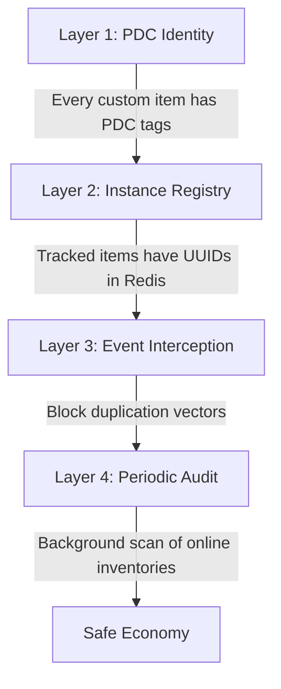
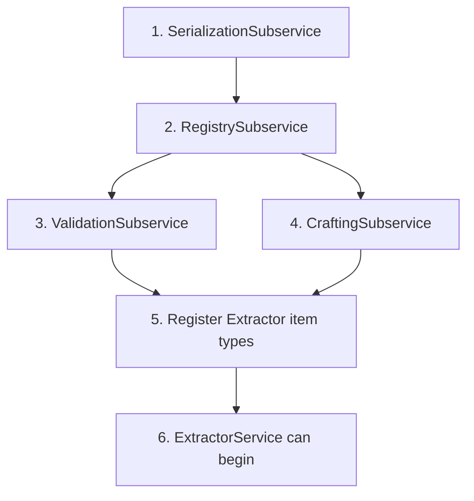

# Custom Item Service — Implementation Plan (Draft)

> **Status:** Draft — prerequisite for the Extractor Mechanic  
> **Tier:** Tier 3 (Service)  
> **Priority:** Must be implemented before any Extractor work begins

---

## 1. Purpose

SurvivalCore currently has **no centralized custom item framework**. Items are created ad-hoc with `ItemStack` + `ItemMeta`. The Extractor Mechanic requires custom items (Scanners, Extractor Cores, Modules, Compact Blocks, Analysis Maps) that must:

- Be uniquely identifiable (distinguish from vanilla items)
- Be safe from duplication exploits
- Support custom crafting recipes
- Support persistent metadata (durability, tier, owner, etc.)
- Be generalizable for future systems beyond extractors

This service provides that foundation.

---

## 2. Design Principles

### Safety First: Anti-Duplication

Duplication is the single greatest threat to a custom item economy. Every design decision must consider:

1. **Unique Identity:** Every custom item instance must carry a **unique ID** (UUID) in its `PersistentDataContainer` (PDC). This makes every item instance traceable.
2. **Registry Validation:** A server-side registry tracks all valid custom item UUIDs. If an item's UUID doesn't exist in the registry, it's invalid.
3. **Single-Instance Enforcement:** For high-value items (Extractors, Modules), the registry ensures only one instance of each UUID exists at any time. If a duplicate is detected, the newer copy is destroyed.
4. **Event Interception:** All duplication vectors must be intercepted:
   - Creative mode inventory clicks
   - Hoppers moving items between inventories
   - Dropper/dispenser interactions
   - Death drops and item pickup
   - Player trading / item frame interactions
   - Bundles and shulker boxes
   - Crafting grid manipulation

### Generalization

The service must NOT be extractor-specific. It should support:
- Any future custom item type (weapons, tools, currency, tokens)
- Configurable behavior per item type (stackable vs unique, tradeable vs bound)
- Custom crafting recipes of any shape

---

## 3. Architecture

### Placement

```
Services (Tier 3)
└── CustomItemService
    ├── CustomItem_RegistrySubservice      — Item type definitions & instance tracking
    ├── CustomItem_CraftingSubservice      — Custom recipe registration & validation
    ├── CustomItem_ValidationSubservice    — Anti-dupe checks & item integrity
    └── CustomItem_SerializationSubservice — PDC read/write & item (de)serialization
```

### Dependencies

| Dependency | Usage |
|------------|-------|
| `DatabaseEssential` | Persist item registry (valid UUIDs) to Redis |
| `ConfigsEssential` | `CustomItemConfig` for item type definitions |
| `ProprietaryEventsInitless` | Fire events: `CustomItemCreatedEvent`, `CustomItemDestroyedEvent`, `DuplicateItemDetectedEvent` |
| `PlayerDataService` | Track player-bound items |
| `InventoryGUIService` | Crafting preview GUIs (optional) |

---

## 4. Core Data Model

### Item Type Definition

```kotlin
data class CustomItemType(
    val id: String,                      // e.g., "compact_diamond_block", "scanner_tier_3"
    val displayName: Component,          // Kyori Adventure component
    val material: Material,              // Base vanilla material (e.g., PLAYER_HEAD, PAPER, COAL_BLOCK)
    val lore: List<Component>,           // Item lore lines
    val customModelData: Int?,           // Optional custom model data for resource packs
    val maxStackSize: Int = 64,          // 1 for unique items (extractors), 64 for bulk items (compact blocks)
    val trackInstances: Boolean = false, // If true, every instance gets a UUID and is tracked
    val playerBound: Boolean = false,    // If true, only the owner can use/move it
    val headSkin: String? = null,        // Base64 skin texture (for PLAYER_HEAD items)
)
```

### Item Instance (PDC Tags)

Every custom item carries these `PersistentDataContainer` tags:

| NamespacedKey | Type | Description | Required |
|---------------|------|-------------|----------|
| `survivalcore:custom_item_type` | STRING | The item type ID (e.g., "scanner_tier_3") | Always |
| `survivalcore:custom_item_uuid` | STRING | Unique instance UUID | Only if `trackInstances = true` |
| `survivalcore:custom_item_owner` | STRING | Owner player UUID | Only if `playerBound = true` |
| `survivalcore:custom_item_data` | STRING | JSON blob for type-specific metadata | Optional |

### Redis Storage

```
customitem:types                    → JSON array of all registered item type IDs
customitem:instance:{instanceUuid}  → JSON with item state (type, owner, creation time, etc.)
```

For bulk items (Compact Blocks) where `trackInstances = false`, no instance-level Redis entry is created — the item is identified solely by its `custom_item_type` PDC tag.

---

## 5. Subservice Details

### 5.1 `CustomItem_RegistrySubservice`

**Responsibility:** Manage item type definitions and instance lifecycle.

**API:**
```kotlin
fun registerType(type: CustomItemType)
fun getType(id: String): CustomItemType?
fun getAllTypes(): List<CustomItemType>

fun createInstance(typeId: String, owner: UUID? = null, metadata: JsonObject? = null): ItemStack
fun destroyInstance(instanceUuid: UUID)
fun isValidInstance(instanceUuid: UUID): Boolean
```

**Key behaviors:**
- `createInstance()` builds the `ItemStack`, sets all PDC tags, and registers the instance UUID in Redis (if tracked)
- `destroyInstance()` removes the instance from Redis, making any copies invalid
- Types are registered at service startup (hard-coded or config-driven)

### 5.2 `CustomItem_CraftingSubservice`

**Responsibility:** Register and validate custom shaped/shapeless crafting recipes.

**API:**
```kotlin
fun registerShapedRecipe(key: String, result: CustomItemType, shape: Array<String>, ingredients: Map<Char, RecipeIngredient>)
fun registerShapelessRecipe(key: String, result: CustomItemType, ingredients: List<RecipeIngredient>)
fun unregisterRecipe(key: String)
```

**`RecipeIngredient`** can be:
- A vanilla `Material`
- A `CustomItemType` ID (matched via PDC tag, not just material type)

**Key behaviors:**
- Uses Bukkit's `ShapedRecipe` / `ShapelessRecipe` for registration
- Intercepts `PrepareItemCraftEvent` to validate that custom ingredients actually carry the correct PDC tags (prevents crafting with vanilla items that share the same base material)
- The crafting result is created via `createInstance()` to ensure proper PDC tagging

### 5.3 `CustomItem_ValidationSubservice`

**Responsibility:** Anti-duplication enforcement.

**Strategy — Layered Defense:**



#### Layer 1: PDC Identity
- Custom items without valid `survivalcore:custom_item_type` tags are **not recognized** by any system
- Vanilla items with the same base material cannot interact with custom systems

#### Layer 2: Instance Registry (Tracked Items Only)
- Every tracked item instance has a UUID registered in Redis
- On item use/interaction, the UUID is checked against Redis
- If the UUID is not in Redis → item is **invalid** → destroy it + log the event

#### Layer 3: Event Interception

Intercept and validate on these Bukkit events:

| Event | Action |
|-------|--------|
| `InventoryClickEvent` | Validate items being moved between inventories |
| `PlayerDropItemEvent` | Mark dropped items; track pickup |
| `EntityPickupItemEvent` | Validate picked-up items against registry |
| `PlayerDeathEvent` | Track all custom items in death drops |
| `InventoryMoveItemEvent` | Block hopper/dropper movement of tracked items |
| `PrepareItemCraftEvent` | Validate custom ingredients; prevent using vanilla look-alikes |
| `PlayerInteractEvent` | Validate on right-click use |
| `BlockPlaceEvent` | Handle items that become world objects (extractors) |

#### Layer 4: Periodic Audit
- A background task periodically scans online players' inventories
- Counts instances of each tracked UUID
- If duplicates are found: destroy all but the oldest, log the incident, alert staff

### 5.4 `CustomItem_SerializationSubservice`

**Responsibility:** Read/write PDC tags and serialize/deserialize custom item metadata.

**API:**
```kotlin
fun writeItemTags(item: ItemStack, type: CustomItemType, instanceUuid: UUID?, owner: UUID?, data: JsonObject?): ItemStack
fun readItemType(item: ItemStack): CustomItemType?
fun readInstanceUuid(item: ItemStack): UUID?
fun readOwner(item: ItemStack): UUID?
fun readMetadata(item: ItemStack): JsonObject?
fun isCustomItem(item: ItemStack): Boolean
```

**Key behaviors:**
- All PDC operations go through this subservice — no raw PDC access elsewhere
- Handles `ItemMeta` acquisition and modification safely
- Serializes/deserializes the `custom_item_data` JSON blob for type-specific metadata

---

## 6. Item Categories for the Extractor Mechanic

Once the Custom Item Service exists, the Extractor Mechanic registers these item types:

| Item Type ID | Base Material | Tracked | Bound | Stack |
|-------------|---------------|---------|-------|-------|
| `compact_coal_block` | COAL_BLOCK | No | No | 64 |
| `compact_iron_block` | IRON_BLOCK | No | No | 64 |
| `compact_diamond_block` | DIAMOND_BLOCK | No | No | 64 |
| *(all compact blocks...)* | *(respective block)* | No | No | 64 |
| `scanner_tier_1` | PLAYER_HEAD | Yes | No | 1 |
| `scanner_tier_2` | PLAYER_HEAD | Yes | No | 1 |
| *(all scanner tiers...)* | PLAYER_HEAD | Yes | No | 1 |
| `analysis_result_map` | FILLED_MAP | Yes | No | 1 |
| `extractor_coal_tier_1` | PLAYER_HEAD | Yes | Yes | 1 |
| `extractor_diamond_tier_3` | PLAYER_HEAD | Yes | Yes | 1 |
| *(all extractor types/tiers...)* | PLAYER_HEAD | Yes | Yes | 1 |
| `module_drill_speed_1` | PLAYER_HEAD | Yes | No | 1 |
| `module_fortune_1` | PLAYER_HEAD | Yes | No | 1 |
| *(all modules...)* | PLAYER_HEAD | Yes | No | 1 |
| `repair_kit` | PLAYER_HEAD | No | No | 16 |

**Design decisions:**
- **Compact Blocks** are NOT tracked (too many in circulation, low risk) — identified by type tag only
- **Scanners, Maps, Extractors, Modules** are all tracked (high value, must prevent duplication)
- **Extractors** are player-bound (only the owner can use/disassemble them)
- **Modules** are NOT player-bound (can be traded between players)

---

## 7. Open Questions

| # | Question | Impact |
|---|----------|--------|
| 1 | Should Compact Blocks use `CustomModelData` for custom textures, or just use lore/name differentiation? | Requires resource pack if using custom models |
| 2 | Should the periodic audit run on a Folia global scheduler or per-region? | Performance vs. thoroughness |
| 3 | Should tracked items survive server restarts via Redis, or should the registry be rebuilt from player inventories on startup? | Data integrity vs. complexity |
| 4 | Should custom crafting use Bukkit's native recipe system or a fully custom implementation? | Bukkit recipes are convenient but limited; custom gives full control but more code |
| 5 | How should the service handle items stored in Ender Chests, Shulker Boxes, and other nested containers for audit purposes? | Deep inspection is expensive but necessary for anti-dupe |

---

## 8. Implementation Order



1. **Serialization** first — everything else depends on PDC read/write
2. **Registry** second — item creation and type management
3. **Validation** and **Crafting** can be built in parallel
4. Once all 4 subservices are functional, register the Extractor item types
5. Then `ExtractorService` development can begin
