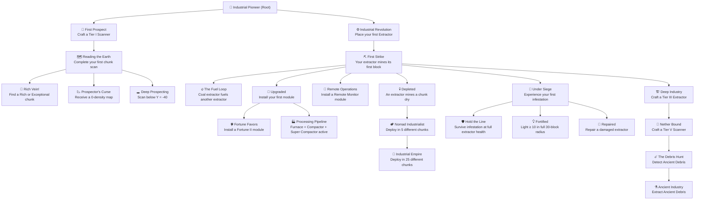

# Player Experience

Design specifications for player onboarding, progression discovery, and recipe discoverability.

---

## 1. The Prospector's Handbook

A craftable **custom written book** item that serves as the in-game reference for the entire Extractor Mechanic. It's thematic, in-world, and requires zero extra UI work.

### Crafting

```
 P  F  P     P = Paper, F = Feather
 P  I  P     I = Ink Sac
 P  P  P
```

### Automatic Distribution

When a player crafts their **first Geological Scanner**, the plugin automatically gives them a Prospector's Handbook if they don't already have one. Players who lose it can craft another.

### Contents (Book Pages)

| Page | Title | Content |
|------|-------|---------|
| 1 | Welcome | What the Extractor Mechanic is and how to start |
| 2 | The Loop | Prospect → Deploy → Extract → Relocate |
| 3 | Scanners | How to craft, calibrate (Material Samples), and read depth requirements |
| 4 | Reading the Map | How to interpret ore density ratings and heatmap colors |
| 5 | Deployment | Placement requirements, fueling, the GUI layout |
| 6 | Heat & Defense | Understanding heat, infestation risk, lighting strategy |
| 7 | Modules | What each module does and their dependencies |
| 8 | Quick Reference | Tier table, material list, key commands |

The Handbook is a vanilla written book (NBT-encoded content), registered as a non-tracked Custom Item (stackable: 1, player-bound: no).

---

## 2. Advancement Tree

### Design Philosophy

- **Discovery** — each advancement explains the next mechanic step; no external wiki required
- **Achievement** — challenge and goal advancements give veteran players long-term motivation
- **Non-blocking** — no advancement gates access to any mechanic; they are purely informational and rewarding

### Tree Structure



### Advancement Definitions

| ID | Title | Description (shown in-game) | Trigger | Type |
|----|-------|-----------------------------|---------|------|
| `root` | 🧭 **Industrial Pioneer** | *The earth holds its secrets. Time to take them.* | First pick-up of any scanner ingredient | Hidden |
| `first_scan` | 🔬 **First Prospect** | Craft a Geological Scanner and begin your journey | Craft any Tier scanner | Task |
| `reading_the_earth` | 🗺️ **Reading the Earth** | Analyze a chunk and receive your first Analysis Result Map | First Analysis Map received | Task |
| `rich_vein` | 💎 **Rich Vein!** | Find a chunk with Rich or Exceptional ore density | Map received with RICH / EXCEPTIONAL rating | **Challenge** |
| `prospectors_curse` | 📉 **Prospector's Curse** | Receive a 0-density map. (Hint: scan deeper, or try a different chunk.) | Map received with 0 density | Task |
| `deep_prospecting` | 🕳️ **Deep Prospecting** | Complete a scan while standing below Y = -40 | Scan completed below Y = -40 | Task |
| `first_extractor` | ⚙️ **Industrial Revolution** | Place your first Extractor Core, insert a map, and add fuel | Extractor transitions to ACTIVE state | Task |
| `first_strike` | ⛏️ **First Strike** | Your machine mines its first ore block from the earth | First successful extraction event | Task |
| `the_fuel_loop` | 🔥 **The Fuel Loop** | Run a Coal Extractor to supply fuel for your other machines | Coal Extractor active while another extractor is fueled by its output | Task |
| `upgraded` | 🔧 **Upgraded** | Install your first upgrade module | Any module inserted | Task |
| `fortune_favors` | 🍀 **Fortune Favors** | Equip a Fortune II module | Fortune II module inserted | Goal |
| `processing_pipeline` | 🏭 **Processing Pipeline** | Run the full processing chain simultaneously | Extractor with Furnace + Compactor + Super Compactor all active | Goal |
| `remote_ops` | 📡 **Remote Operations** | Install a Remote Monitor module to keep tabs on your machines | Any Remote Monitor module inserted | Task |
| `depleted` | 💀 **Depleted** | Your machine has mined a chunk completely dry | Extractor status → DEPLETED | Task |
| `nomad` | 🏕️ **Nomad Industrialist** | Deploy extractors in 5 different chunks | 5th unique chunk deployment recorded | Goal |
| `empire` | 🏰 **Industrial Empire** | Deploy extractors in 25 different chunks across the world | 25th unique chunk deployment | **Challenge** |
| `under_siege` | 🧟 **Under Siege** | Your extractor has attracted attention | First infestation event triggered | Task |
| `hold_the_line` | 🛡️ **Hold the Line** | Defend your extractor perfectly — no damage taken | Infestation ends with extractor at 100% health | **Challenge** |
| `fortified` | 💡 **Fortified** | Eliminate all dark spawning spots within the 30-block radius | Light ≥ 10 at all positions in 30-block radius around active extractor | Goal |
| `repaired` | 🔨 **Repaired** | Bring a damaged extractor back to full health | Extractor repaired to 100% via GUI | Task |
| `deep_industry` | 🏗️ **Deep Industry** | Craft a Tier III Extractor — the turning point | Craft any Tier III extractor | Goal |
| `nether_bound` | 🌋 **Nether Bound** | Craft a Tier V Scanner and prepare for the worst | Craft Tier V scanner | Goal |
| `debris_hunt` | ☄️ **The Debris Hunt** | Detect Ancient Debris in the Nether | Receive map with Ancient Debris detected | **Challenge** |
| `ancient_industry` | ⚗️ **Ancient Industry** | Extract Ancient Debris from the Nether's depths | First Ancient Debris extracted | **Challenge** (toast: *"You have tamed the Nether's deepest secret."*) |

**Advancement Types:**
- **Task** — standard grey frame, announced quietly
- **Goal** — rounded green frame, signals a major milestone
- **Challenge** — ornate purple frame, announces to all online players

---

## 3. Recipe Book Integration

### Strategy: Progressive Unlocking

Custom recipes are registered with Bukkit's recipe system via `player.discoverRecipe(NamespacedKey)`. Recipes are unlocked as players progress naturally — new players aren't overwhelmed on first join.

| Unlock Trigger | Recipes Revealed |
|----------------|-----------------|
| **First join** | Compact Block recipes (all materials) — the entry point to the economy |
| **Craft any Scanner** | All Scanner tier recipes (II through V) |
| **Craft any Extractor Core** | All Extractor Core recipes for all material types |
| **Craft any Module** | All Module recipes |
| **Craft a Repair Kit** | Nothing new — Handbook auto-given if missing |

### Known Limitation: Custom Ingredient Icons

The vanilla recipe book cannot visually distinguish custom PDC-tagged items from their base vanilla material (e.g., a Compact Diamond Block uses the same icon as a vanilla Diamond Block). Mitigations:

1. **Item lore** on every custom item states its type: `§8[Compact Diamond Block]`
2. **PrepareItemCraftEvent** rejects any recipe where the correct PDC tags are absent, even if the base material matches — so the recipe book can guide the player but vanilla items cannot substitute
3. **Recipe tooltips** (via lore text or advancement descriptions) note where custom items are required

### Fallback Command

| Command | Effect |
|---------|--------|
| `/extractor recipes` | Opens a full GUI listing all Extractor Mechanic recipes organized by category (Compact Blocks / Scanners / Extractors / Modules / Repair) |

This is the definitive reference for players who find the recipe book icons ambiguous.
