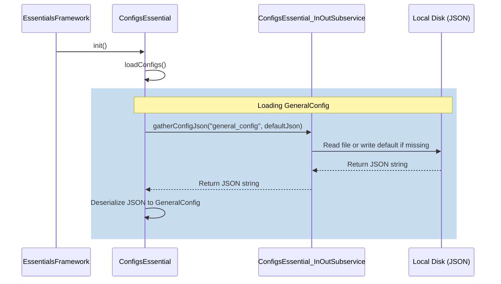

# ConfigsEssential Module Documentation

The `ConfigsEssential` module is a core infrastructure service (Tier 2 - Essentials) in **SurvivalCore**. It handles all plugin configuration loading, dynamic file updating, serialization/deserialization, and hot-reloads, ensuring that both essential and higher-tier systems have access to reliable, type-safe settings.

---

## 1. Intentions & Design Philosophy

The primary objective of the `ConfigsEssential` system is to isolate configuration I/O from runtime usage. It operates under the following key design principles:

* **Type Safety & In-Memory Representation**: Configurations are serialized/deserialized directly into strongly typed Kotlin classes (`GeneralConfig`, `PlayerDataConfig`, `ChatConfig`). Other systems access config values via properties, eliminating string-key lookups.
* **Auto-Versioning & Dynamic Appending**: The system maintains an internal version code for each configuration file. When a new plugin update adds new fields, the system automatically detects older config files on disk and appends the new fields without erasing existing user settings.
* **Cross-Platform Robustness**: The system avoids hardcoded path separators (like `\\`) and redundant prefixes, guaranteeing seamless operations on Windows, Linux, and macOS.
* **Gson Defensiveness**: Since Gson uses reflection and bypasses standard constructor calls for missing JSON fields, the module implements nullable fields and safe default fallback mechanisms to prevent `NullPointerException` crashes.

---

## 2. Module Architecture & Components

The module is structured with clean separation of concerns:

```
src/main/kotlin/site/ftka/survivalcore/essentials/configs/
├── ConfigsAPI.kt                  # Public-facing API exposed to other modules
├── ConfigsEssential.kt            # Core service manager (Tier 2 hook)
├── CONFIG_ESSENTIAL.md            # Module documentation (this file)
├── subservices/
│   └── ConfigsEssential_InOutSubservice.kt # Handles File I/O & JSON parsing
└── configurations/
    ├── ChatConfig.kt              # Chat systems configuration
    ├── PlayerDataConfig.kt        # Player persistence & caching configuration
    └── GeneralConfig.kt           # Spawn locations, Redis connection details, etc.
```

### Key Components

1. **`ConfigsEssential` (Manager)**
   Acts as the central coordinator. It maintains the in-memory instances of all configurations (`GeneralConfig`, `PlayerDataConfig`, `ChatConfig`) and handles bootstrap (`init`), hot-reloads (`restart`), and cleanup (`stop`).
2. **`ConfigsAPI` (Public Interface)**
   Provides a clean access layer. Higher-tier services or apps query this API to get references to the configuration objects (e.g. `ess.configs.api.playerDataCfg()`).
3. **`ConfigsEssential_InOutSubservice` (File I/O)**
   Deals directly with the local storage. It is responsible for creating directory paths (e.g., `plugins/SurvivalCore/configs`), writing default configurations, reading JSON contents, and handling standard file exceptions gracefully.
4. **`configurations/` (Data Models)**
   Standard POJO/Kotlin data representations. They define default values and include a `toJson()` helper method using a pretty-printed `GsonBuilder`.

---

## 3. Inner Workings & Execution Flows

### A. Initialization & Loading Flow
During server start, `EssentialsFramework` invokes `ConfigsEssential.init()`, triggering the following workflow:



1. **Gather Json**: `ConfigsEssential_InOutSubservice` checks if the corresponding `.json` file exists in `plugins/SurvivalCore/configs/`. If it does not exist, it writes the default JSON from memory.
2. **Deserialize**: `Gson().fromJson(json, ConfigsClass::class.java)` parses the JSON string into the config instance.
3. **Version Check**: The system compares the deserialized version (`generalConfig.version`) against the fresh class instantiation version (`GeneralConfig().version`).

---

## 4. Dynamic Versioning & Defensive Deserialization

### A. How Auto-Versioning Works
When a plugin update introduces new options (e.g., adding `DATABASE` configurations in `GeneralConfig` v2), the system dynamically appends the new properties without resetting the user's customized values:

1. The class definition's version is bumped (e.g., `var version: Int = 2` in `GeneralConfig.kt`).
2. If `generalConfig.version < GeneralConfig().version` is true:
   * The version is updated in memory (`generalConfig.version = GeneralConfig().version`).
   * The system checks if any new fields (like `DATABASE`) are null (due to being missing on disk) and populates them with standard defaults.
   * `ConfigsEssential_InOutSubservice.createConfig` is called with `overwrite = true` to serialize the updated in-memory object back to disk, preserving all unmodified custom settings while cleanly appending the new fields.

### B. Gson Null-Defense Pattern
Since Gson uses reflection during deserialization, any field omitted in the JSON will bypass standard constructor initializers and end up as `null` in JVM memory. To prevent this, the module implements:

1. **Nullable Declarations**: Optional config sections are declared as nullable properties (e.g. `var DATABASE: DatabaseConfig? = DatabaseConfig()`).
2. **Defensive Getters/Fallbacks**: Services consuming the configurations use the safe Elvis operator fallback:
   ```kotlin
   val dbCfg = configs.generalCfg().DATABASE ?: GeneralConfig.DatabaseConfig()
   ```
   This ensures that even if a config file is manually corrupted or lacks specific sections, the plugin falls back to safe system defaults instead of crashing with a `NullPointerException`.
