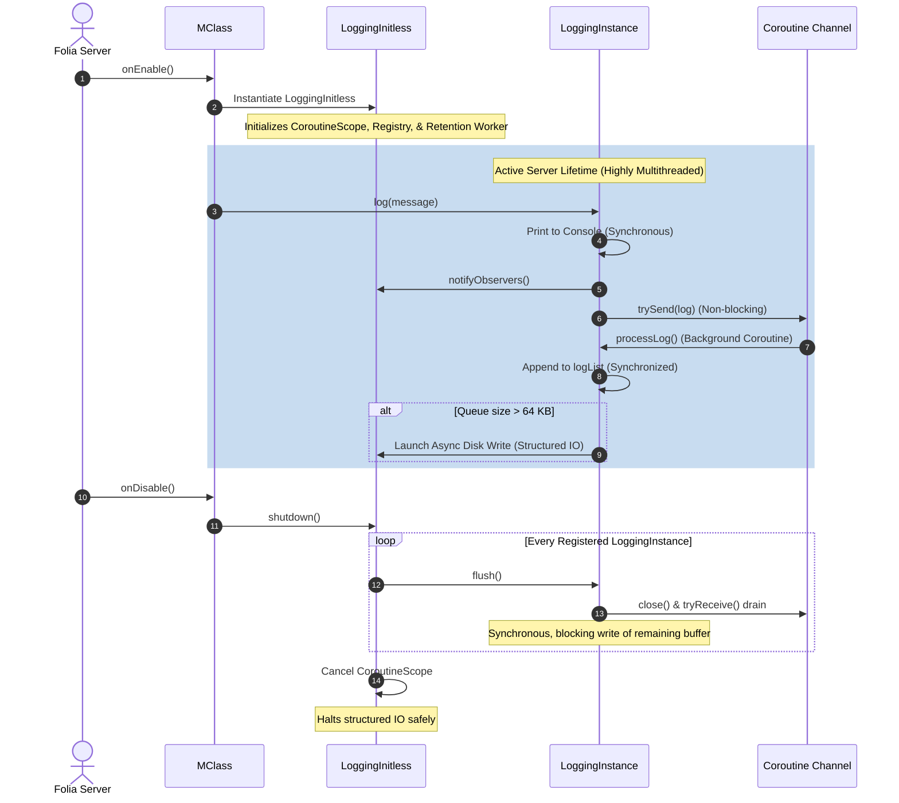

# Logging System Module (LoggingInitless) - Exhaustive Technical Specification

The **Logging System** (`LoggingInitless`) is a critical, Tier 1 (Initless / Bootstrap) component of the SurvivalCore framework. Operating with zero downstream dependencies, it is initialized before all other systems to establish the plugin's centralized logging, debugging, console-auditing, and local JSON diagnostics rolling-file storage infrastructure.

---

## 🗺️ Architectural Class Roles

The logging module is comprised of three core classes designed to abstract, queue, print, and write system operations:

```
  ┌──────────────────────────────────────────────────────────┐
  │                       LoggingInitless                    │
  │     - Bootstrap lifecycle controller                     │
  │     - Thread-safe console colored printer                │
  │     - Active instance registry (ConcurrentLinkedQueue)   │
  │     - Structured CoroutineScope (IO + SupervisorJob)     │
  └───────────────────────────┬──────────────────────────────┘
                              │
                              │ Instantiates & Registers
                              ▼
  ┌──────────────────────────────────────────────────────────┐
  │                       LoggingInstance                    │
  │     - Context-specific buffer (e.g. Chat, Database)      │
  │     - In-memory queue (synchronized logList)             │
  │     - Circular threshold-based flushing (64 KB cap)      │
  │     - Lifecycle synchronous flush support                │
  └───────────────────────────┬──────────────────────────────┘
                              │
                              ├──────────────────────────────┐
                              ▼                              ▼
                 ┌────────────────────────┐      ┌────────────────────────┐
                 │          Log           │      │       SubLogger        │
                 │   - Color & Timestamp  │      │ - Context tag prefixer │
                 │   - LogLevel mapping   │      │   (e.g. subsystem name)│
                 └────────────────────────┘      └────────────────────────┘
```

### 1. `LoggingInitless` (Core Controller)
* **Path:** `src/main/kotlin/site/ftka/survivalcore/initless/logging/LoggingInitless.kt`
* **Role:**
  * Serves as the plugin's primary logging bootstrap instance.
  * Manages the structured `CoroutineScope` (`Dispatchers.IO + SupervisorJob`) responsible for non-blocking file-system I/O.
  * Maintains a thread-safe registry of all active `LoggingInstance` objects (`ConcurrentLinkedQueue<LoggingInstance>`) to facilitate automatic flushes on server shutdown/reload.
  * Handles thread-safe console output, using a synchronized monitor lock (`colorLock`) to alternate message colors and enhance readability.
  * **Retention Worker**: Automatically prunes older JSON log files upon initialization (keeps the newest 50 files per logger by default) to prevent unbounded disk consumption.
  * **Log Observer Pipeline**: Supports the `LogObserver` interface, allowing external integrations (e.g., Discord webhooks, Sentry) to register and receive all generated logs lock-free.
  * **Admin Query API**: Exposes `queryLogs()`, which parses recent JSON files and loads structured log objects into memory for dynamic in-game search commands.

### 2. `LoggingInstance` (Buffer & Contextual Logger)
* **Path:** `src/main/kotlin/site/ftka/survivalcore/initless/logging/objects/LoggingInstance.kt`
* **Role:**
  * Represents a distinct logger associated with a specific framework module (e.g., `PlayerDataService`, `DatabaseEssential`).
  * Employs a **Lock-Free Coroutine Channel** (`Channel<Log>`) pipeline. Caller threads immediately push log data into the channel without blocking on file size estimations.
  * A dedicated background coroutine consumes the channel sequentially, safely appending logs to the local in-memory buffer (`logList`).
  * Automatically offloads in-memory queues to rolling JSON files on local disk when the queue size exceeds `64 KB` (`logsMaxSize = 1024 * 64` bytes).
  * Exposes a `flush()` function allowing synchronous, blocking channel drains and disk writes during server shutdowns to prevent data loss.

### 3. `Log` (Data Model)
* **Path:** `src/main/kotlin/site/ftka/survivalcore/initless/logging/objects/Log.kt`
* **Role:**
  * Simple data class representing a singular log record.
  * Stores text message content (`Component`), timestamp (`System.currentTimeMillis()`), display color, and log verbosity level.

### 4. `LoggingInstance.SubLogger` (Context Helper)
* **Role:**
  * Embedded utility class facilitating sub-component context tags (e.g., prefixing `[Database] {HealthCheck}`).

---

## ⚡ Thread Safety & Concurrency Model

Folia executes Bukkit-style operations across multiple regions concurrently in a highly multi-threaded environment. As such, the Logging module enforces strict thread-safety:

1. **Console Printing Synchronization:** Alternating color switches are performed under a private `colorLock` object inside `print(...)` in `LoggingInitless` to avoid color alternation corruption.
2. **Lock-Free Channel Pipeline:** Invoking `log()` simply pushes the object into a `Channel<Log>(Channel.UNLIMITED)`. This means high-frequency logging from Folia region threads is completely non-blocking.
3. **Buffer Queue Locks:** Writes (`logList.add()`) and state updates (`logsSize += ...`) are performed sequentially by the channel consumer, but are still protected inside a `synchronized(logList)` block to allow safe atomic draining during the synchronous `flush()` shutdown hook.
4. **Structured Concurrency:** A custom `CoroutineScope` with a `SupervisorJob()` manages async tasks to handle crashes/exceptions in writing coroutines without tearing down the parent scope.

---

## 📁 OS Compatibility & File Format

The logging system features zero platform constraints and runs natively across Windows, Linux, and macOS:

* **Separators:** Employs platform-agnostic `File(parent, child)` constructors, avoiding hardcoded `/` or `\\` characters.
* **Windows Filename Safety:** Translates file timestamps using the safe `yyyy-MM-dd_HH-mm-ss` format. By omitting forbidden colon (`:`) characters, filesystem-level write exceptions on Windows systems are completely resolved.
* **Character Encoding:** Enforces standard `StandardCharsets.UTF_8` when writing log dumps to preserve unicode formatting and Minecraft chat color characters.

---

## 🔍 Administrative Commands & Query API

Administrators can dynamically query and read recent logs from disk directly inside Minecraft chat using the `ServerAdministrationApp` (`/server` command).

* **Command syntax:** `/server logs query <loggerName> [limit]`
* **Usage Example:** `/server logs query PlayerData 20` retrieves the last 20 logs specifically generated by the PlayerData module, parsing the active JSON log files and rendering them cleanly with Kyori adventure components in the staff member's chat.

---

## 📊 Serialization JSON Schema

Logs are dumped into a structured, pretty-printed GSON array format.

### Log Model Schema
```typescript
interface LogJSON {
  color: {
    name: string;      // e.g. "yellow"
  };
  text: {
    extra?: Array<{    // Kyori Adventure Component JSON
      text: string;
      color?: string;
    }>;
    text: string;      // Raw text content
  };
  level: "DEBUG" | "HIGH" | "NORMAL" | "LOW";
  timestamp: number;   // Epoch millisecond timestamp
}
```

### Raw JSON Dump Example
```json
[
  {
    "color": {
      "name": "yellow"
    },
    "text": {
      "extra": [
        {
          "text": "Redis connection pool initialized successfully.",
          "color": "green"
        }
      ],
      "text": ""
    },
    "level": "NORMAL",
    "timestamp": 1780283948000
  }
]
```

---

## 🔄 Lifecycle Integration



---

## 🛠️ Troubleshooting Matrix

| Issue | Potential Cause | Verification Step | Resolution |
| :--- | :--- | :--- | :--- |
| **No logs written to disk** | Output levels disabled | Check values of `dumpableLogLevels` inside target class. | Ensure `LogLevel.DEBUG` or desired levels are in `dumpableLogLevels`. |
| **Missing directory / permissions** | Read-only OS directory | Check if `logs/` folder exists under the plugin folder. | Execute `chmod 755` on the plugin directory or run under an account with write permissions. |
| **Swallowed IOException error** | System out of space or file locks | Inspect standard error console log (System.err) for stack trace prefixes: `[SurvivalCore Logging]`. | Free disk space or close files locked by the OS editor. |
| **Out of order console logs** | Printing was async | Not applicable in updated codebase. | Handled safely by the new synchronous print pipeline. |
