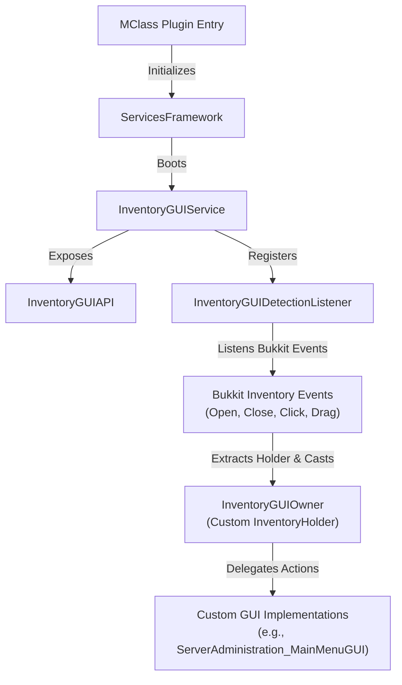

# Exhaustive Operations & Integration Documentation: InventoryGUI Module

This document serves as the absolute reference for the **InventoryGUI** module in `SurvivalCore`. It details the architecture, class layouts, internal mechanics, proprietary events, recent optimization refactors, and developer integration guides.

---

## 1. Architectural System Overview

The `InventoryGUI` module is an event-driven, memory-leak-free, lightweight framework designed to spawn custom chest-based inventory interfaces, handle slot click interactions, block item manipulation exploits, and facilitate clean multi-panel navigation in Minecraft Folia.



### 1.1 Core Mechanics Flow
* **Inventory Creation**: The developer implements the `InventoryGUIOwner` interface and requests a new inventory from `InventoryGUIAPI`. The API calls the service, which wraps the owner in a Bukkit-compliant `Inventory` container.
* **Event Interception**: When a player opens, clicks, drags inside, or closes the inventory, `InventoryGUIDetectionListener` captures the Bukkit event.
* **Casting and Routing**: The listener inspects `inventory.holder`. If the holder implements `InventoryGUIOwner`, the listener bypasses any global registries and routes the event directly to the owner's corresponding lifecycle/interaction functions.
* **Clean Garbage Collection**: Because the inventory and its holder are bound naturally by Bukkit's runtime and no persistent global references are stored, the custom GUI is cleanly garbage collected as soon as the inventory is closed and player references are cleared.

---

## 2. Comprehensive Class & Subservice Breakdown

### 2.1 InventoryGUIService (Module Core)
* **Path:** [InventoryGUIService.kt](file:///home/srleg/Projects/survivalcore/src/main/kotlin/site/ftka/survivalcore/services/inventorygui/InventoryGUIService.kt)
* **Purpose:** Core orchestrator. Initializes the module's detection listener, fires proprietary initialization/restart events, provides a service-wide logger (`LoggingInstance`), and serves as the inventory factory.
* **Factory Overloads:**
  * `createInventory(owner, type, title)`: Generates an inventory using a standard `InventoryType` (e.g., `InventoryType.HOPPER`).
  * `createInventory(owner, size, title)`: Generates a chest-sized inventory using a direct integer `size` (must be a multiple of 9, e.g., `27` or `54`).

### 2.2 InventoryGUIAPI (Facade Boundary)
* **Path:** [InventoryGUIAPI.kt](file:///home/srleg/Projects/survivalcore/src/main/kotlin/site/ftka/survivalcore/services/inventorygui/InventoryGUIAPI.kt)
* **Purpose:** Facade wrapper exposing GUI factory methods to external modules (such as `PermissionsManagerApp` and `ServerAdministrationApp`) while hiding internal logging and initialization mechanics.

### 2.3 InventoryGUIOwner (Interaction Interface)
* **Path:** [InventoryGUIOwner.kt](file:///home/srleg/Projects/survivalcore/src/main/kotlin/site/ftka/survivalcore/services/inventorygui/interfaces/InventoryGUIOwner.kt)
* **Purpose:** Custom `InventoryHolder` extension representing a GUI's logical owner. Declares interaction callbacks.
* **Default Implementations**: Every method has a default empty implementation (`{}`), meaning developers only implement the callbacks they actually need, drastically reducing boilerplate code.
* **Lifecycle Callbacks**:
  * `openEvent(event: InventoryOpenEvent)`
  * `closeEvent(event: InventoryCloseEvent)`
  * `clickEvent(event: InventoryClickEvent)`
  * `dragEvent(event: InventoryDragEvent)`

### 2.4 InventoryGUIDetectionListener (Event Router)
* **Path:** [InventoryGUIDetectionListener.kt](file:///home/srleg/Projects/survivalcore/src/main/kotlin/site/ftka/survivalcore/services/inventorygui/listeners/InventoryGUIDetectionListener.kt)
* **Purpose:** Intercepts Bukkit's low-level inventory events.
* **Mechanics:** 
  * Checks if `event.inventory.holder` is an instance of `InventoryGUIOwner`.
  * If valid, routes the event directly to the holder.
  * Direct casting removes the need for slow/buggy global lookup maps.

### 2.5 InventoryGUI_AnvilInput (Folia-Ticking Real Anvil Input GUI)
* **Path:** [InventoryGUI_AnvilInput.kt](file:///home/srleg/Projects/survivalcore/src/main/kotlin/site/ftka/survivalcore/services/inventorygui/InventoryGUI_AnvilInput.kt)
* **Purpose:** Provides a premium, reusable, location-bound real Anvil-based text input field that ticks and calculates natively under Folia.
* **Mechanics:**
  * Opens a tracked anvil container via `Player.openAnvil` at the player's active regional thread location, ensuring Spigot's standard anvil ticking and `PrepareAnvilEvent` fire natively.
  * Temporarily awards the player 1,000 experience levels to satisfy the client-side anvil rename cost requirement.
  * Tracks active inputs via `activeAnvilInputs` cache in `InventoryGUIService` to cleanly route clicks, drags, close events, and anvil updates.
  * Listens to slot 2 clicks to extract the renamed plain-text value, cancels the click, closes the inventory, and invokes a callback with the results.
  * Safely restores the player's original experience level and XP progress on close, preventing exploits.

---

## 3. Recent Critical Fixes & Improvements

We performed an exhaustive audit and implemented the following improvements:

1. **Virtual Anvil Text Input GUI**:
   * *Problem*: Chat-based text prompts can be messy or fail to feel like premium UI components. Additionally, Minecraft client-side prediction logic causes the client to believe it successfully took the anvil's result item (creating ghost items such as papers named `"000000"` or containing `"Preview"`) when Slot 2 is clicked or when the window is closed immediately.
   * *Fix*: Added the fully self-contained `InventoryGUI_AnvilInput` utility to prompt players for input using a standard, highly interactive Minecraft anvil interface. Bypasses client-side XP requirements safely and cleans up experience records instantly upon closure. Implemented a bulletproof, 1-tick delayed `cleanupGhostItems` task running on the player's regional scheduler during all click and close events. To prevent any risk of wiping a player's legitimate custom survival papers (even if named `"000000"`), the system applies a unique custom `NamespacedKey` tag (`survivalcore:virtual_anvil_input`) to all virtual anvil placeholder and result items using the Persistent Data Container (PDC). The delayed cleanup task strictly filters by this unique tag, ensuring player-owned items are never touched while ghost papers/panes are eradicated and synchronized via `player.updateInventory()`.
2. **Duplicate Inventory Creation Fix**: 
   * *Problem*: The previous implementation of `createInventory` called `Bukkit.createInventory` twice, storing the first result in an unused variable and returning the second redundant instance.
   * *Fix*: Cleaned up the method to execute the call exactly once and return the instantiated inventory directly.
2. **Zero-Leak & Zero-Collision Architecture**:
   * *Problem*: The module previously stored every spawned `InventoryGUIOwner` in a global `inventoryOwnersMap` map and looked them up by `ownerName`. This caused a major **memory leak** (closed GUIs were never purged) and a severe **collision bug** (if two players opened the same type of GUI with the same `ownerName`, they overwrote each other's instances in the map, routing one player's click events to another's GUI).
   * *Fix*: Entirely deleted the `inventoryOwnersMap` registry. Instead, we utilize Bukkit's native `inventory.holder` structure and cast it directly via `as? InventoryGUIOwner`. This is thread-safe, 100% leak-free, and prevents any instance collisions.
3. **Custom Chest Sizing**:
   * *Problem*: The factory was locked to standard `InventoryType` constraints, preventing the creation of standard chest GUIs with custom row configurations (e.g., a 5-row chest with 45 slots).
   * *Fix*: Added a new overloaded `createInventory` method accepting a custom integer `size`, allowing standard multiples of 9 (9 to 54 slots).
4. **Developer Boilerplate Pruning**:
   * *Problem*: The `InventoryGUIOwner` interface lacked default method bodies, forcing every custom GUI implementation to declare empty functions for open, close, and click events even if they were unused.
   * *Fix*: Added empty default implementations (`{}`) to the interface methods in Kotlin.
5. **Exploit Mitigation via Drag Events**:
   * *Problem*: The listener did not monitor `InventoryDragEvent`. Clever players could drag items across slots inside the custom GUI to duplicate items, steal GUI icons, or bypass security rules.
   * *Fix*: Added `InventoryDragEvent` support to both `InventoryGUIOwner` and `InventoryGUIDetectionListener`.

---

## 4. Developer Integration Guide

To build an interactive, exploit-safe GUI in your application, follow this standardized implementation pattern.

### 4.1 Step 1: Define Your Custom GUI Class
Implement the `InventoryGUIOwner` interface. Ensure that you block item theft by default by canceling click and drag events if they interact with the GUI slots!

```kotlin
package site.ftka.survivalcore.apps.ServerAdministration.gui

import net.kyori.adventure.text.Component
import net.kyori.adventure.text.format.NamedTextColor
import org.bukkit.Material
import org.bukkit.entity.Player
import org.bukkit.event.inventory.InventoryClickEvent
import org.bukkit.event.inventory.InventoryDragEvent
import org.bukkit.inventory.Inventory
import org.bukkit.inventory.ItemStack
import site.ftka.survivalcore.MClass
import site.ftka.survivalcore.services.inventorygui.interfaces.InventoryGUIOwner

class ServerAdministration_MainMenuGUI(
    private val plugin: MClass, 
    private val player: Player
) : InventoryGUIOwner {

    override val ownerName = "ServerAdminMainMenu_${player.uniqueId}"
    private val inv: Inventory

    init {
        val title = Component.text("Server Panel").color(NamedTextColor.DARK_AQUA)
        // Create a 3-row chest GUI (27 slots)
        inv = plugin.servicesFwk.inventoryGUI.api.createInventory(this, 27, title)
        
        setupItems()
    }

    private fun setupItems() {
        // Example icon: Redstone block to reload services
        val reloadButton = ItemStack(Material.REDSTONE_BLOCK).apply {
            itemMeta = itemMeta?.apply {
                displayName(Component.text("Reload Services").color(NamedTextColor.RED))
            }
        }
        inv.setItem(13, reloadButton) // Place in center slot
    }

    override fun getInventory(): Inventory = inv

    override fun clickEvent(event: InventoryClickEvent) {
        val clickedInv = event.clickedInventory ?: return
        
        // If the player clicks inside the custom GUI (top inventory)
        if (clickedInv == inv) {
            event.isCancelled = true // Prevent them from taking/stealing the item block!
            
            when (event.slot) {
                13 -> {
                    player.closeInventory()
                    player.sendMessage(Component.text("Reloading core services...").color(NamedTextColor.YELLOW))
                    plugin.servicesFwk.restartAll()
                }
            }
        } else {
            // Optional: If they click their own inventory (bottom), prevent quick-moving items into the GUI
            if (event.isShiftClick) {
                event.isCancelled = true
            }
        }
    }

    override fun dragEvent(event: InventoryDragEvent) {
        // Safely cancel any drag events inside the GUI to block drag exploits
        if (event.rawSlots.any { it < inv.size }) {
            event.isCancelled = true
        }
    }
}
```

### 4.2 Step 2: Spawning the GUI for a Player
Simply instantiate your custom GUI class and open it via the player instance:

```kotlin
val gui = ServerAdministration_MainMenuGUI(plugin, player)
player.openInventory(gui.inventory)
```
