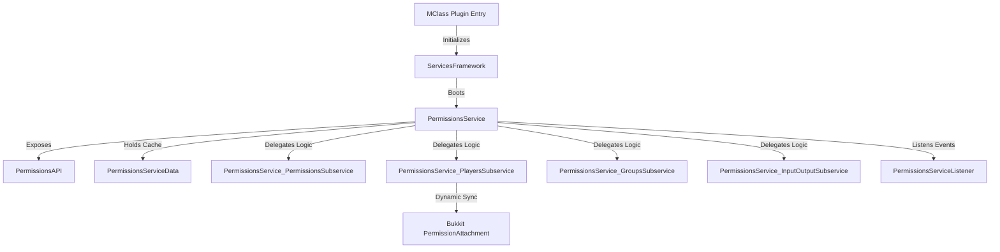

# Exhaustive Operations & Integration Documentation: Permissions Module

This document serves as the absolute reference for the **Permissions** module in `SurvivalCore`. It details the architecture, class layouts, internal mechanics, and critical cross-module dependencies to facilitate tracking, auditing, and debugging.

---

## 1. Architectural System Overview

The `Permissions` module is designed around a thread-safe, modular, three-tier model where the main service acts as a mediator delegating specialized responsibilities to dedicated subservices.



---

## 2. Comprehensive Class & Subservice Breakdown

### 2.1 PermissionsService (Module Core)
* **Path:** [PermissionsService.kt](file:///home/srleg/Projects/survivalcore/src/main/kotlin/site/ftka/survivalcore/services/permissions/PermissionsService.kt)
* **Purpose:** Core orchestrator. Initializes subservices, registers the event listener, provides service-wide logger configuration, and exposes internal Gson instances to conserve garbage collector operations.

### 2.2 PermissionsAPI (Interface Boundary)
* **Path:** [PermissionsAPI.kt](file:///home/srleg/Projects/survivalcore/src/main/kotlin/site/ftka/survivalcore/services/permissions/PermissionsAPI.kt)
* **Purpose:** The clean public-facing facade. Restricts raw access to service internals, ensuring higher-tier modules (e.g. apps or essentials) interact with permissions through validated methods.

### 2.3 PermissionsServiceData (Cache & Storage Layout)
* **Path:** [PermissionsServiceData.kt](file:///home/srleg/Projects/survivalcore/src/main/kotlin/site/ftka/survivalcore/services/permissions/PermissionsServiceData.kt)
* **Purpose:** Standardizes in-memory storage of permission groups.
* **Fields:**
  * `groupsMap: ConcurrentHashMap<UUID, PermissionGroup>` — Maps group UUIDs to their in-memory representation.
  * `groupsNameIDMap: ConcurrentHashMap<String, UUID>` — Maps case-sensitive group names to their respective UUIDs for fast queries.
* **Behavior:** Automatically invalidates calculation caches on mutating additions (`materializeGroup`) or removals (`deMaterializeGroup`).

### 2.4 PermissionsService_PermissionsSubservice (Resolution Engine)
* **Path:** [PermissionsService_PermissionsSubservice.kt](file:///home/srleg/Projects/survivalcore/src/main/kotlin/site/ftka/survivalcore/services/permissions/subservices/PermissionsService_PermissionsSubservice.kt)
* **Purpose:** Resolves permission checks, manages calculations, and implements wildcard/inheritance algorithms.
* **Wildcard Check:** Implements a progressive left-to-right prefix matching algorithm to match hierarchical checks (e.g., matching a player's `survivalcore.admin.*` against `survivalcore.admin.permissions.mutate`).
* **Inheritance & Encapsulation:** Implements recursive traversal of nested group inheritance while keeping the recursive loop parameter (`traversed`) completely private:
  ```kotlin
  fun groupPerms(groupUUID: UUID, includeInheritances: Boolean = true): Set<String> {
      return calculateGroupPerms(groupUUID, includeInheritances, mutableSetOf())
  }
  ```
  Circular references (e.g., A inherits B, B inherits C, C inherits A) are gracefully broken by checking `!traversed.contains(inh)` *before* calling recursion, avoiding duplicate stack frames or application crashes.

### 2.5 PermissionsService_PlayersSubservice (Integration & Dynamic Sync)
* **Path:** [PermissionsService_PlayersSubservice.kt](file:///home/srleg/Projects/survivalcore/src/main/kotlin/site/ftka/survivalcore/services/permissions/subservices/PermissionsService_PlayersSubservice.kt)
* **Purpose:** Bridges players with groups and permissions. Mutates player data configurations via `PlayerDataService`'s transactional locks.
* **Bukkit Attachment Engine:** Manages Spigot's `PermissionAttachment` collection. Schedules all attachment updates to run on the player's EntityScheduler to be Folia-compatible:
  ```kotlin
  fun refreshAttachment(player: Player) {
      player.scheduler.execute(plugin, Runnable {
          // Calculates and applies standard Spigot permissions...
      }, null, 0L)
  }
  ```

### 2.6 PermissionsService_GroupsSubservice (Group Mutation Engine)
* **Path:** [PermissionsService_GroupsSubservice.kt](file:///home/srleg/Projects/survivalcore/src/main/kotlin/site/ftka/survivalcore/services/permissions/subservices/PermissionsService_GroupsSubservice.kt)
* **Purpose:** Standardizes creating, deleting, and renaming groups, along with adding/removing inheritance vectors.
* **Dynamic Refreshes:** Any structural group modification immediately invalidates calculating caches and triggers an asynchronous recalculation of standard attachments for all online players.

### 2.7 PermissionsService_InputOutputSubservice (JSON Persistence)
* **Path:** [PermissionsService_InputOutputSubservice.kt](file:///home/srleg/Projects/survivalcore/src/main/kotlin/site/ftka/survivalcore/services/permissions/subservices/PermissionsService_InputOutputSubservice.kt)
* **Purpose:** Manages serialization of permission groups to `plugins/SurvivalCore/groups/{groupname}.json`. Resolves and fixes group name casing discrepancies on disk during boot while preserving in-memory consistency.

---

## 3. Critical Cross-Module Connections & Dependencies

To easily track down, debug, and trace system anomalies, developers must understand the four direct integration channels:

```
+-----------------------------------------------------------------------------------+
|                                    SurvivalCore                                   |
+-----------------------------------------------------------------------------------+
                                          |
        +---------------------------------+---------------------------------+
        |                                 |                                 |
        v                                 v                                 v
+-----------------------+       +-------------------+             +-----------------+
|   PlayerDataService   |       |  UsernameTracker  |             |  ChatEssential  |
|                       |       |                   |             |                 |
| - Persisted data store|       | - Maps UUIDs from |             | - Manages Chat  |
| - Registers attachment|       |   offline names   |             |   GUI screens   |
|   on Player Register  |       | - Allows offline  |             | - Command screen|
| - Updates Redis keys  |       |   mutations       |             |   routing       |
+-----------------------+       +-------------------+             +-----------------+
        |                                 |                                 |
        +---------------------------------+---------------------------------+
                                          |
                                          v
                        +-----------------------------------+
                        |         PermissionsModule         |
                        +-----------------------------------+
```

### 3.1 PlayerDataService
* **Integration Vector:** Permissions and groups are stored inside the player's persistent Redis profile (`PlayerData.permissions`). 
* **Data Path Flow:**
  * When `PermissionsService_PlayersSubservice.addGroup()` is executed, it invokes `PlayerDataService.inout_ss.makeModification(playerUUID)`.
  * The modification is locked, applied, saved to Redis, cached in `PlayerDataServiceData`, and finally, the permissions cache is cleared and the player's `PermissionAttachment` is recompiled.
* **Boot Hook:** `PermissionsServiceListener` intercepts the custom `PlayerDataRegisterEvent` fired by `PlayerDataService.registration_ss` once player data has finished loading from Redis. The listener immediately attaches the player's permissions to the Spigot permissible instance:
  ```kotlin
  @PropEventHandler
  fun onPlayerDataRegister(event: PlayerDataRegisterEvent) {
      val player = plugin.server.getPlayer(event.uuid) ?: return
      service.players_ss.refreshAttachment(player)
  }
  ```

### 3.2 UsernameTrackerEssential
* **Integration Vector:** Resolving target players for admin modifications.
* **Flow:** Since permissions can be changed for offline players, the commands `/perms {player} addperm ...` do not resolve targets using Spigot's `getPlayer()`. Instead, they query the `UsernameTracker` using:
  ```kotlin
  val targetUUID = plugin.essentialsFwk.usernameTracker.getUUID(args[0])
  ```
  This resolves the correct `UUID` from the history log database, allowing the transaction engine to load and write to the offline player's Redis data profile safely.

### 3.3 ChatEssential
* **Integration Vector:** Administration Chat GUI routing.
* **Flow:** The interactive permissions panel is managed by `PermissionsManager_ChatScreen` which inherits from `ChatScreen`. 
  * Administrative commands `/perms` and `/groups` open the screen by executing:
    ```kotlin
    chatAPI.showOrRefreshScreen(player.uniqueId, chatScreen, "player_groups")
    ```
  * Custom inputs, clicking buttons to delete permissions, or using tab-completers trigger routing internally using `ChatEssential` page routing:
    ```kotlin
    chat.api.refreshScreen(sender.uniqueId, name, "group_permissions")
    ```

### 3.4 Spigot/Paper MC Server Platform
* **Integration Vector:** Platform commands and permissible mapping.
* **Registration:** Command descriptors and aliases (`/permissions`, `/perms`, `/p`, `/groups`, `/group`, `/g`) are registered inside Spigot's `plugin.yml` and bound in `PermissionsManagerApp.kt`.
* **Standard Permissions Compatibility:** Binds custom groups and permissions into Paper MC's native permissible mapping by building and managing a local `PermissionAttachment` for every active player. This guarantees standard Spigot API commands (e.g., `/op` overrides, WorldEdit commands, and Vault integration checks) interact with custom groups seamlessly.

---

## 4. Operational File Layouts

### Group Serialization Schema
Groups are serialized as pretty-printed JSON files:
```json
{
  "uuid": "4ac60f2b-8a8b-49ea-96b0-13f59e7a835a",
  "name": "vip",
  "displayName": "VIP",
  "tag": "[VIP]",
  "category": "normal",
  "primaryColor": "gray",
  "secondaryColor": "dark_gray",
  "perms": [
    "survivalcore.chat.color",
    "minecraft.command.teleport"
  ],
  "inheritances": [
    "e9d1bf7a-62df-4ad5-9abf-7c191a329d49"
  ]
}
```

---

## 5. Troubleshooting & Audit Flow

When diagnosing permissions-related issues, follow this systematic audit process:

| Issue Symptom | Root Cause Verification Path | Target Resolution |
|---|---|---|
| Permissions do not apply to third-party plugins | Check if `PermissionsServiceListener` successfully attached the permissible attachment on join. Confirm `refreshAttachment` was executed on the primary thread. | Re-trigger permissible sync by forcing a player data load or executing the command to refresh attachments. |
| Inheritance loops causing crashes | Verify circular paths by looking at group inheritances on disk. Check that `calculateGroupPerms` returns `emptySet()` when hitting a node in `traversed`. | The system now automatically drops circular invocations. Circular trees resolve cleanly. |
| In-memory group state does not match files | Casing mismatch in `.json` filename vs `name` attribute in file. | `readGroupsFromStorage` now automatically detects and renames mismatched filenames and synchronizes names in cache on boot. |
| Administrative commands print usage errors | Commands are being run without permissions, or argument counts are incorrect. | Verify the sender has `survivalcore.admin.permissions` and check command logs. |
| Concurrent Modification Exceptions | Asynchronous access to groups or player calculations. | All maps in `PermissionsServiceData` are migrated to `ConcurrentHashMap`. Any modification must flow through thread-safe subservices. |
