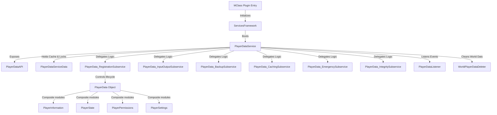

# Exhaustive Operations & Integration Documentation: PlayerData Module

This document serves as the absolute reference for the **PlayerData** module in `SurvivalCore`. It details the architecture, class layouts, internal mechanics, proprietary events, and critical cross-module dependencies to facilitate tracking, auditing, and debugging.

---

## 1. Architectural System Overview

The `PlayerData` module is a thread-safe, modular, multi-tier system designed to manage player data persistence, local caching, integrity verification, emergency failovers, and transactional modifications. It overrides the default Spigot/Paper player data saving mechanisms to serve as the single source of truth using Redis and local emergency storage.



### 1.1 Core Mechanics Flow
* **Player Join**: `PlayerDataListener` checks database health, puts the player in the online player map, and invokes the `RegistrationSubservice`. The `RegistrationSubservice` gets or creates the `PlayerData` via the `InputOutputSubservice` (which searches `queuedPlayerData`, cache, active players, and Redis), runs integrity checks (backing up and recreating components if corruption is found), restores the physical state of the player (health, inventory, locations, velocity), and fires `PlayerDataRegisterEvent`.
* **Player Quit**: `PlayerDataListener` removes the player from the online map and invokes the `RegistrationSubservice` to unregister. The `RegistrationSubservice` fires `PlayerDataPreUnregisterEvent`, gathers current player state/info, sets it in Redis (automatically dumping it locally if database connection fails), and removes it from active memory while firing `PlayerDataUnregisterEvent`.
* **World Cleanup**: `WorldPlayerDataDeleter` intercepts initial boot and player logouts to recursively purge Minecraft's default `world/playerdata/` folder, ensuring no local `.dat` files compete with Redis as the source of truth.

---

## 2. Comprehensive Class & Subservice Breakdown

### 2.1 PlayerDataService (Module Core)
* **Path:** [PlayerDataService.kt](file:///home/srleg/Projects/survivalcore/src/main/kotlin/site/ftka/survivalcore/services/playerdata/PlayerDataService.kt)
* **Purpose:** Core orchestrator. Initializes subservices, registers listeners, provides base folder path config (`plugins/SurvivalCore/PlayerData`), manages service-wide logging (`LoggingInstance`), and orchestrates safe synchronous restart/stop procedures.
* **Restart Procedure:**
  1. Sets `isRestarting = true` to pause async modifications or registrations.
  2. Iterates and synchronously unregisters every online player (forces database save or emergency dumps).
  3. Verifies database ping health. If down, shuts down the Minecraft server to prevent data loss.
  4. Clears active data maps.
  5. Uploads all local emergency dumps to Redis.
  6. Re-registers all active online players.
  7. Resets `isRestarting = false` and fires `PlayerDataRestartEvent`.

### 2.2 PlayerDataAPI (Facade Boundary)
* **Path:** [PlayerDataAPI.kt](file:///home/srleg/Projects/survivalcore/src/main/kotlin/site/ftka/survivalcore/services/playerdata/PlayerDataAPI.kt)
* **Purpose:** Restricts direct raw access to services. Exposes safe access methods for other modules:
  * `exists(uuid: UUID)`: Checks if a player's data is loaded in active memory.
  * `getPlayerData_locally(uuid: UUID)`: Fetches data directly from active memory cache.
  * `getPlayerData(uuid: UUID)`: Loads data through the transaction broker (checks caches, memory, and database).

### 2.3 PlayerDataServiceData (Active State & Mutex Registry)
* **Path:** [PlayerDataServiceData.kt](file:///home/srleg/Projects/survivalcore/src/main/kotlin/site/ftka/survivalcore/services/playerdata/PlayerDataServiceData.kt)
* **Purpose:** Manages in-memory maps for loaded player data and online player lists. Standardizes dynamic coroutine locks to prevent race conditions during concurrent logins, logouts, or modifications.
* **Mechanics:**
  * `playerDataMap`: Maps online player `UUID`s to their parsed `PlayerData` representation.
  * `onlinePlayers`: Maps `UUID`s to their current names.
  * `lifecycleLocks`: Maps `UUID`s to distinct `Mutex` instances.
  * `getLock(uuid)`: Atomically gets or initializes a player's transaction lock.
  * `cleanupLock(uuid)`: Purges locks from memory if they are not currently locked, avoiding memory leaks.

### 2.4 PlayerData_InputOutputSubservice (Transaction Broker)
* **Path:** [PlayerData_InputOutputSubservice.kt](file:///home/srleg/Projects/survivalcore/src/main/kotlin/site/ftka/survivalcore/services/playerdata/subservices/PlayerData_InputOutputSubservice.kt)
* **Purpose:** Resolves, writes, and modifies player data asynchronously or synchronously.
* **Request Buffer (`requestsBuffer`)**: Saves the last 10 raw JSON strings fetched from Redis. In case of schema updates that trigger Kotlin parsing errors, `PlayerData_BackupSubservice` pulls the crude payload from this buffer to generate an uncorrupted backup file.
* **Get Path Sequence:**
  1. `queuedPlayerData`: Holds the most recent, pending-to-be-saved database write.
  2. `caching_ss`: TTL cache.
  3. `data` map: Active memory.
  4. Redis Database: Fetches through `essentialsFwk.database.get()`.
* **Set Path Sequence:** Writes to Redis. If the database write fails or health check fails, it captures the payload and redirects it to the `EmergencySubservice` to serialize to disk immediately.
* **Modification Engine (`makeModification`)**: Coroutine transaction pipeline.
  ```kotlin
  suspend fun makeModification(uuid: UUID, modification: (PlayerData) -> Boolean): PlayerDataModificationResult
  ```
  - Acquires UUID `Mutex` lock.
  - Resolves data (memory if online, database if offline).
  - Invokes modification block.
  - For **online** players: updates memory (persists to DB on quit or autosave).
  - For **offline** players: immediately executes `set(pdata, async = true).await()` to prevent state loss.
  - Releases lock and cleans up registry.

### 2.5 PlayerData_BackupSubservice (JSON Recovery Engine)
* **Path:** [PlayerData_BackupSubservice.kt](file:///home/srleg/Projects/survivalcore/src/main/kotlin/site/ftka/survivalcore/services/playerdata/subservices/PlayerData_BackupSubservice.kt)
* **Purpose:** Automatically backs up raw JSON from the database when a player joins with corrupted data (such as null modules).
* **Behavior:** Saves files in `plugins/SurvivalCore/PlayerData/Backups/{uuid}.json` (or `{uuid}_{copyCount}.json`). It pulls directly from the raw request buffer, preserving crude properties that would otherwise be discarded during GSON parsing failure.

### 2.6 PlayerData_CachingSubservice (TTL Cache Layer)
* **Path:** [PlayerData_CachingSubservice.kt](file:///home/srleg/Projects/survivalcore/src/main/kotlin/site/ftka/survivalcore/services/playerdata/subservices/PlayerData_CachingSubservice.kt)
* **Purpose:** Prevents duplicate database hits for players logging out and quickly logging back in (or API queries right after logouts).
* **Behavior:** Configurable via `playerdata.json` config (`timeToLiveMillis` and `clockLoopTimeSecs`). Runs a scheduled cleaner task that deletes expired caches. Calling `getCachedPlayerData()` with `deleteIt = true` cleanses cache on retrieval.

### 2.7 PlayerData_EmergencySubservice (Disk Serializer & Reconnection Sync)
* **Path:** [PlayerData_EmergencySubservice.kt](file:///home/srleg/Projects/survivalcore/src/main/kotlin/site/ftka/survivalcore/services/playerdata/subservices/PlayerData_EmergencySubservice.kt)
* **Purpose:** Prevents data loss when Redis drops connection.
* **Mechanics:**
  * `emergencyDump(playerdata)`: Synchronously dumps the active player data into local storage at `plugins/SurvivalCore/PlayerData/EmergencyDump/{username}_{uuid}.json`.
  * `uploadAllDumpsToDatabase(async)`: Executed upon database reconnection or service restart. It scans the `EmergencyDump` folder and asynchronously saves dumps back to Redis **only if** the emergency dump's `updateTimestamp` is greater than the current database entry's timestamp (preventing overwriting newer database changes).

### 2.8 PlayerData_IntegritySubservice (Layout Sanitizer)
* **Path:** [PlayerData_IntegritySubservice.kt](file:///home/srleg/Projects/survivalcore/src/main/kotlin/site/ftka/survivalcore/services/playerdata/subservices/PlayerData_IntegritySubservice.kt)
* **Purpose:** Verifies that a deserialized `PlayerData` instance is structurally complete.
* **Behavior:** Asserts that `state`, `information`, `permissions`, and `settings` are not null. Returns `false` if any are missing (signaling data corruption).

### 2.9 PlayerData_RegistrationSubservice (Lifecycle Orchestration)
* **Path:** [PlayerData_RegistrationSubservice.kt](file:///home/srleg/Projects/survivalcore/src/main/kotlin/site/ftka/survivalcore/services/playerdata/subservices/PlayerData_RegistrationSubservice.kt)
* **Purpose:** Manages the step-by-step join/quit registration pipeline inside coroutines, ensuring proper initialization and cleanup.
* **Join (register):** Fetches or creates data, updates timestamp, runs integrity checks, handles corruptions by backing up and rewriting default modules, updates name maps, applies physical statistics to the Spigot player, and fires `PlayerDataRegisterEvent`.
* **Quit (unregister):** Fetches in-memory data, fires `PlayerDataPreUnregisterEvent` (so other components can append final states), gathers physical metrics from the player, saves to Redis (with fallback emergency dumps), clears active memory, fires `PlayerDataUnregisterEvent`, and releases mutex.

---

## 3. Composite Objects & Data Modules

### 3.1 PlayerData (Root Compound)
* **Path:** [PlayerData.kt](file:///home/srleg/Projects/survivalcore/src/main/kotlin/site/ftka/survivalcore/services/playerdata/objects/PlayerData.kt)
* **Structure:** Combines the player's core modules, manages standard `updateTimestamp`, and implements `toJson()` using pretty-printed GSON.

### 3.2 PlayerInformation (Identity & Connection History)
* **Path:** [PlayerInformation.kt](file:///home/srleg/Projects/survivalcore/src/main/kotlin/site/ftka/survivalcore/services/playerdata/objects/modules/PlayerInformation.kt)
* **Fields:**
  * `username: String` — Active Minecraft username.
  * `usernameHistory: MutableMap<Long, String>` — Records each historical name change with a millisecond timestamp.
  * `lastConnection: Long?` — Last connection timestamp.
  * `firstConnection: Long` — First connection timestamp.

### 3.3 PlayerPermissions (Group Membership Cache)
* **Path:** [PlayerPermissions.kt](file:///home/srleg/Projects/survivalcore/src/main/kotlin/site/ftka/survivalcore/services/playerdata/objects/modules/PlayerPermissions.kt)
* **Fields:**
  * `groups: Set<UUID>` — Collection of assigned group UUIDs.
  * `permissions: Set<String>` — Individual assigned player-specific permission nodes.
  * `displayGroup: UUID?` — Active display rank.

### 3.4 PlayerSettings (Player Preferences)
* **Path:** [PlayerSettings.kt](file:///home/srleg/Projects/survivalcore/src/main/kotlin/site/ftka/survivalcore/services/playerdata/objects/modules/PlayerSettings.kt)
* **Fields:**
  * `language: String` — Player preferred language code (defaults to `"en"`).

### 3.5 PlayerState (Gameplay State Serializer)
* **Path:** [PlayerState.kt](file:///home/srleg/Projects/survivalcore/src/main/kotlin/site/ftka/survivalcore/services/playerdata/objects/modules/PlayerState.kt)
* **Purpose:** Captures and restores the physical, vanilla state of the player on login/logout.
* **Features:**
  * **Stats:** Health, food level, saturation, experience, levels, gamemode.
  * **Potion Effects:** Custom nested data class `SerializedPotionEffect` to map type, duration, amplifier, ambient, particles, and icon attributes.
  * **Location & Physics:** Bed location, standard coordinates (`SerializedLocation`), momentum velocity vectors (`Triple<Double, Double, Double>`), fall distance.
  * **Inventory Serialization:** Encodes inventories and enderchests to Base64 strings mapped by slot ID (`MutableMap<Int, String>`) using the `base64Utils` helper to store items compactly in JSON.
  * **Bukkit Location Sync Correction:** Applies physical coordinates 1 tick after joining, and velocity 2 ticks after joining, preventing Spigot from resetting coordinates or canceling velocity vectors upon login.

---

## 4. Proprietary Lifecycle Events

All events extend the proprietary `PropEvent` interface, running synchronously.

| Event Name | Fired By | Purpose | Payloads |
|---|---|---|---|
| `PlayerDataInitEvent` | `PlayerDataService.init()` | Triggers 1 second after service initialization. | N/A |
| `PlayerDataRegisterEvent` | `RegistrationSubservice.finishRegistration()` | Fired when a player's data is fully loaded and applied. | `uuid: UUID`, `playerdata: PlayerData?`, `isFirstJoin: Boolean` |
| `PlayerDataPreUnregisterEvent` | `RegistrationSubservice.unregister()` | Fired immediately on quit before gathering physical metrics. | `uuid: UUID`, `playerdata: PlayerData`, `player: Player` |
| `PlayerDataUnregisterEvent` | `RegistrationSubservice.finishUnregistration()` | Fired when player data is successfully purged from memory. | `uuid: UUID`, `playerdata: PlayerData?` |
| `PlayerDataRestartEvent` | `PlayerDataService.restart()` | Fired when the service completes its live-reloading process. | N/A |

---

## 5. Critical Cross-Module Connections & Dependencies

```
+-----------------------------------------------------------------------------------+
|                                    SurvivalCore                                   |
|                                (MClass Main Entry)                                |
+-----------------------------------------------------------------------------------+
                                          |
         +--------------------------------+--------------------------------+
         |                                |                                |
         v                                v                                v
+------------------+             +------------------+             +-----------------+
| DatabaseEssential|             |ConfigsEssential  |             |LanguageService  |
|                  |             |                  |             |                 |
| - Redis engine   |             | - cache configs  |             | - Localized error|
| - Health checks  |             | - clocks & TTLs  |             |   messages      |
+------------------+             +------------------+             +-----------------+
         |                                |                                |
         +--------------------------------+--------------------------------+
                                          |
                                          v
                        +-----------------------------------+
                        |         PlayerDataService         |
                        +-----------------------------------+
                                   |             |
                   +---------------+             +---------------+
                   |                                             |
                   v                                             v
        +---------------------+                       +--------------------+
        |  PermissionsService |                       |    ChatEssential   |
        |                     |                       |                    |
        | - Attaches groups/  |                       | - Channel maps on  |
        |   perms on register |                       |   registration     |
        +---------------------+                       +--------------------+
```

### 5.1 DatabaseEssential (Redis Engine)
* **Dependency:** Custom Redis engine acts as the database tier.
* **Pathways:** 
  * `essentialsFwk.database.get(key, async)` and `essentialsFwk.database.set(key, value, async)`.
  * `DatabaseDisconnectEvent` & `DatabaseReconnectEvent`: `PlayerDataListener` intercepts these. When database drops, it kicks online players and dumps their local states to files via `emergencyDump()`. When database recovers, it reads local files and asynchronously uploads them back to Redis.

### 5.2 ConfigsEssential
* **Dependency:** Reads configuration rules for the local cache.
* **Pathways:**
  * Queries `essFwk.configs.playerdataCfg()` to read TTL and clock-loop seconds to configure the `CachingSubservice`.

### 5.3 LanguageService
* **Dependency:** Maps client language settings and formats errors.
* **Pathways:**
  * `LanguageServiceListener` intercepts `PlayerDataRegisterEvent` to bind the player's stored language setting (`PlayerData.settings.language`) into the `LanguageServiceData.playerLangMap`, removing it on `PlayerDataUnregisterEvent`.
  * Registration subservice displays `playerdata_error_corruptedPlayerData` message to players during corruption recovery.

### 5.4 PermissionsService
* **Dependency:** Resolves dynamic attachments.
* **Pathways:**
  * `PermissionsServiceListener` intercepts `PlayerDataRegisterEvent` to fetch the permissions and groups stored inside `PlayerData.permissions` and compile a Spigot-compatible `PermissionAttachment` bound to the active player thread.

### 5.5 ChatEssential
* **Dependency:** Maps chat channels.
* **Pathways:**
  * `ChatListener` intercepts `PlayerDataRegisterEvent` to add the player to global channels, their personal channel, and the staff channel (if they hold `staff.*` permissions). It also restores their chat history buffer and halts their active chat screens on `PlayerDataUnregisterEvent`.

---

## 6. Operational File Layouts

### 6.1 PlayerData JSON Schema
Saved in Redis under the player's `UUID` key. Formatted as:
```json
{
  "uuid": "3988d2e9-60c4-4d81-bed0-a6b6c2d13080",
  "information": {
    "username": "srleg",
    "usernameHistory": {
      "1716952800000": "srleg"
    },
    "lastConnection": 1716953000000,
    "firstConnection": 1716952800000
  },
  "state": {
    "isDead": false,
    "health": 20.0,
    "foodLevel": 20,
    "saturation": 20.0,
    "experience": 0.5,
    "level": 15,
    "gameMode": "SURVIVAL",
    "potionEffects": [
      {
        "type": "SPEED",
        "duration": 600,
        "amplifier": 1,
        "ambient": false,
        "particles": true,
        "icon": true
      }
    ],
    "bedLocation": {
      "world": "world",
      "x": -100.0,
      "y": 64.0,
      "z": 150.0,
      "yaw": 0.0,
      "pitch": 0.0
    },
    "serializedLocation": {
      "world": "world",
      "x": 12.5,
      "y": 70.0,
      "z": -45.2,
      "yaw": 90.0,
      "pitch": 15.0
    },
    "momentum": [0.0, -0.078, 0.0],
    "fall_distance": 0.0,
    "inventory": {
      "0": "rO0AB...[Base64 Encoded ItemStack]",
      "36": "rO0AB...[Base64 Encoded Helmet]"
    },
    "enderchest": {
      "0": "rO0AB...[Base64 Encoded ItemStack]"
    }
  },
  "permissions": {
    "groups": [
      "4ac60f2b-8a8b-49ea-96b0-13f59e7a835a"
    ],
    "permissions": [
      "survivalcore.teleport.cooldown.bypass"
    ],
    "displayGroup": "4ac60f2b-8a8b-49ea-96b0-13f59e7a835a"
  },
  "settings": {
    "language": "es"
  },
  "updateTimestamp": 1716953000000
}
```

### 6.2 Emergency Dump Path & Schema
* **Path:** `plugins/SurvivalCore/PlayerData/EmergencyDump/{username}_{uuid}.json`
* **Schema:** Identical to the JSON schema above, preserving state exactly as it was loaded in memory at the time of database failure.

### 6.3 Backup Path
* **Path:** `plugins/SurvivalCore/PlayerData/Backups/{uuid}.json`
* **Schema:** Raw unparsed JSON string captured directly from the Redis connection before deserialization failed.

---

## 7. Troubleshooting & Audit Flow

When diagnosing player data issues, use the following tracking procedures:

| Issue Symptom | Root Cause Verification Path | Target Resolution |
|---|---|---|
| Player is kicked immediately upon joining | Database connection failed or timed out. Check console logs for `Database health check failed` or `Unable to communicate with database`. | Verify Redis connection settings. Restart Redis or check database latency metrics. |
| Player inventory or state resets on rejoin | Corrupted database JSON triggered an integrity failure. A raw JSON backup was created in `Backups/` and default modules were re-initialized. | Inspect `plugins/SurvivalCore/PlayerData/Backups/{uuid}.json` to identify conflicting variables. Manually fix the JSON or re-apply modules. |
| Modified offline data changes are lost | The change was made asynchronously without waiting for the database transaction, or lock was not acquired. | Ensure modifications use `PlayerDataService.inout_ss.makeModification(uuid) { ... }` which forces immediate synchronization on offline profiles. |
| Player velocity or fall damage is glitched on join | Bukkit applied coordinates synchronously during login, overwriting the custom state, or velocity vectors were cancelled. | The system applies coordinates after a 1-tick delay and velocity after a 2-tick delay. Verify custom plugins are not overriding the teleport events. |
| Memory leaks on highly active servers | Mutex locks are piling up in the lock registry for players who have already disconnected. | Check that `service.data.cleanupLock(uuid)` is being invoked at the end of the registration/unregistration processes inside subservices. |
| Emergency dumps are not uploading on reconnect | The local dump has an older or identical `updateTimestamp` than the current Redis entry. | The system automatically protects against overwriting newer database data. Verify clock synchronization across server instances. |
