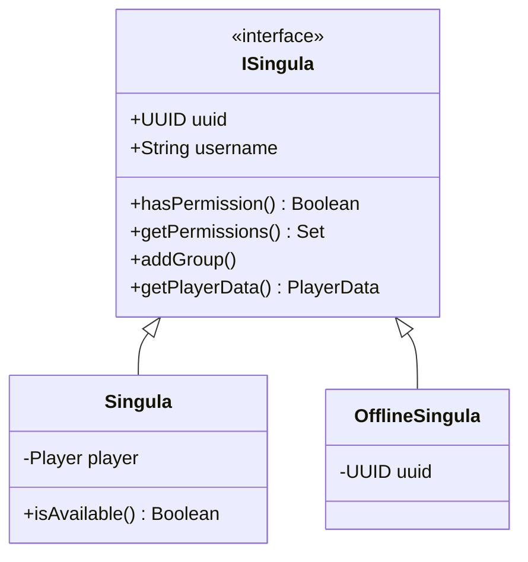

# Singula Service (Low-Level Implementation)

## Overview
The **Singula** service is an internal facade that unifies access to player-centric data across multiple disjointed services (Permissions, PlayerData, Chat, Language). It eliminates the need for developers to manually inject or invoke multiple APIs when performing operations on a single player.

## Architecture & Interfaces

The service fundamentally relies on polymorphism via the `ISingula` interface.

### 1. `Singula` (Online Wrapper)
Wraps a live Bukkit `Player` object. 
- **Fast memory checks**: When a player is online, permissions and data are often stored in caching layers or `ConcurrentHashMap`s in their respective services. `Singula` accesses these synchronously when possible, but exposes them as `suspend` functions to adhere to the `ISingula` contract.
- **Chat Integration**: Provides exclusive (non-interface) methods to interact with `ChatAPI` (e.g., `showScreen`, `sendMessage`) since offline players cannot receive UI updates.

### 2. `OfflineSingula` (Offline Wrapper)
Wraps a `UUID` for a disconnected player.
- **Slower Redis lookups**: Automatically routes calls through async Redis operations using `CompletableFuture`s internally inside the underlying APIs.
- **Internal unwrapping**: Unwraps these futures using `kotlinx.coroutines.future.await()` internally, providing a clean `suspend` return to the caller.

## Folia Thread-Safety (Critical)
Because this plugin is designed for Folia, **Region Threads must never be blocked**. 
Historically, this module utilized `runBlocking` to wrap asynchronous Redis calls. This has been completely refactored. Every method inside `ISingula` that might touch a database is explicitly declared as a `suspend fun`. 
Callers **must** launch a coroutine to interact with Singula if the operation involves disk or Redis I/O.

## Subservice Routing
`ISingula` maps properties and operations to the following APIs internally via direct, static property assignments to minimize getter allocation overhead:
- `PermissionsAPI`: Groups, display groups, local & remote permissions.
- `PlayerDataAPI`: Core serialized `PlayerData` profiles.
- `ChatAPI` (Online only): Channels, action bars, chat logs, screens.
- `LanguageAPI` (Online only): Locale preferences.
