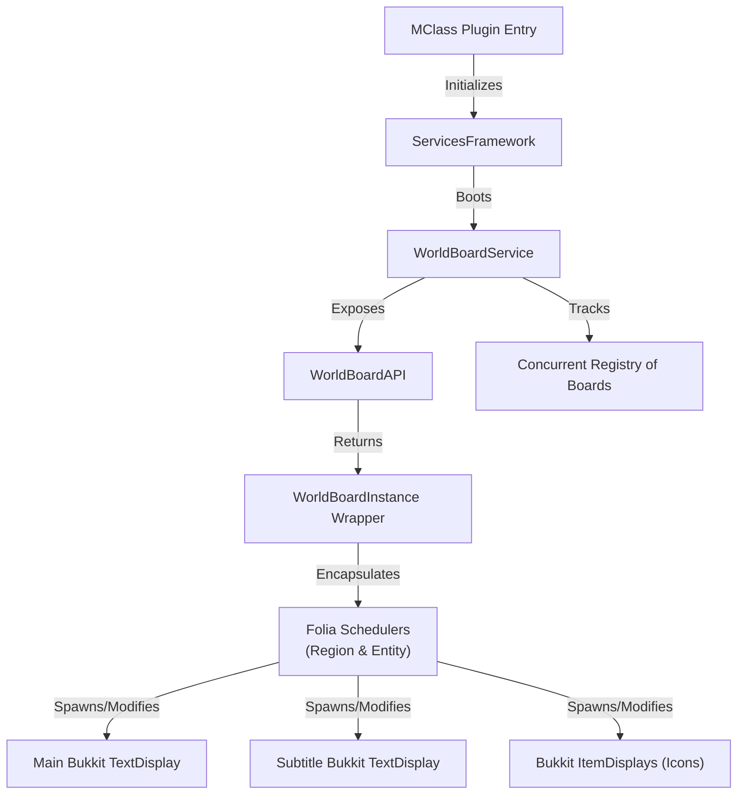

# WorldBoard Service Documentation

This document serves as the absolute reference for the **WorldBoard** module in `SurvivalCore`. It details the architecture, multithreading compliance, and implementation methodology for managing holographic display entities natively.

---

## 1. Architectural System Overview

The `WorldBoard` module provides an extremely performant, thread-safe, memory-leak-free framework for spawning in-world floating holograms utilizing Minecraft's modern `TextDisplay` entities. It entirely replaces legacy armor-stand hologram systems, relying instead on client-side matrix transformations and GPU interpolations.



### 1.1 Folia Multi-threading Compliance
A paramount design pillar of this module is its absolute adherence to the Folia threading rules:
* **Spawning**: Bound exclusively to `plugin.server.regionScheduler`, guaranteeing the entity enters the world on the specific thread owning the target chunk.
* **Modifications & Despawning**: Bound to the native `entity.scheduler`, ensuring all text updates, scale changes, and final removals do not trigger `ThreadStateException` crashes.
* **Atomic Safety**: A `@Volatile` text buffer and an `AtomicBoolean` removal flag safeguard against race conditions if a consumer attempts to delete a board on the same tick it is being asynchronously spawned.

---

## 2. Component Breakdown

### 2.1 WorldBoardService (Module Core)
* **Path:** `WorldBoardService.kt`
* **Purpose:** Core orchestrator. It manages the global `ConcurrentHashMap` of active `WorldBoardInstance`s.
* **Cleanup Strategy**: 
    * **Teardown**: On `stop()` or `restart()`, the service performs instant synchronous removal on all tracked displays to ensure no ghost entities remain during reloads.
    * **Persistent NBT Tagging**: All spawned entities are injected with a custom persistent metadata tag (`NamespacedKey` `"survivalcore:worldboard"` with the board's ID).
    * **Automatic Orphan Sweep**: The service implements `Listener` and registers a `ChunkLoadEvent` sweep that automatically scans loading chunks on their region threads. On startup, it also runs an initial scan of loaded chunks via the `regionScheduler`. Any entity with the tag that is not active in the registry is instantly deleted.
    * **Legacy Fallback Cleanups**: If a `TextDisplay` does not have the PDC tag but contains `"WORLD BOARD TEST"` in its text component, it is automatically wiped as a legacy ghost, clearing old display leaks instantly.

### 2.2 WorldBoardAPI (Facade Boundary)
* **Path:** `WorldBoardAPI.kt`
* **Purpose:** Exposes concise methods (`createBoard`, `getBoard`, `removeBoard`) to higher-tier applications or lateral services without exposing the underlying concurrent registries.

### 2.3 WorldBoardInstance (Entity Wrapper)
* **Path:** `objects/WorldBoardInstance.kt`
* **Purpose:** The active representation of a board.
* **Capabilities:** 
  * Abstracts all scheduler execution blocks away from the consumer.
  * Facilitates matrix animations through `triggerScaleAnimation()`.
  * Pre-configured with premium aesthetics (centered billboarding, transparent glass backing, text glow, drop shadows).
  * **Subtitle Engine:** Supports spawning and animating an entirely independent secondary `TextDisplay` anchored below the main board (at exactly Y: -0.35f), ideal for tax indicators or discounts, without bloating the main bounding box.
  * **Native GPU Interpolation:** Completely detaches all spawned entities from passenger/mount chains, guaranteeing 100% pure vanilla client-side `teleportDuration` interpolation for buttery smooth movement (eliminates all server-side TPS stutter).
  * Native integration with the **Frame Facility**, automatically wrapping text strings inside aesthetic shapes.

### 2.4 WorldBoardFrame (Aesthetic Framing)
* **Path:** `objects/WorldBoardFrame.kt`
* **Purpose:** Provides an elegant, pre-configured Unicode box-drawing frame (`ROUNDED`) with a MiniMessage gradient backing.
* **Dynamic Wrapping:** If a frame is assigned to an instance (`board.frame = WorldBoardFrame.ROUNDED`), calling `board.updateText()` will automatically re-wrap the new text inside the borders without any extra effort required by the consuming app.

### 2.5 WorldBoardTextLayout & Multi-Icon Rendering
* **Path:** `objects/WorldBoardTextLayout.kt`, `objects/WorldBoardIcon.kt`
* **Purpose:** Provides flawless, dynamic inline rendering of 3D item holograms (Minecraft Items) intermixed with the TextDisplay string.
* **Mechanics:** 
  * The TextLayout builder generates spaces automatically to make room for `ItemStack` icons.
  * The `MinecraftFontWidthCalculator` parses the exact pixel widths of the preceding string (utilizing the vanilla 5px character rules).
  * The pixels are scaled to absolute block offsets (`0.025` blocks per pixel) and used to calculate the precise X translation for each item's `ItemDisplay` relative to the centered `TextDisplay`.
  * The Z-axis translation can be fine-tuned via the `zOffset` parameter in `appendIcon` (defaulting to `-0.03f`), which pushes the 3D items slightly "inside the wall" to avoid excessive protrusion and seamlessly blend with the text. Items with `isSolid == true` (like blocks) dynamically ignore this offset to prevent clipping, while flat textures (like Wheat) sink perfectly in front of the wall.
  * The `WorldBoardInstance` iterates through the generated `WorldBoardIcon` definitions and spawns/synchronizes companion `ItemDisplay` entities perfectly next to the text. These icons are intentionally **not** mounted as passengers to allow for flawless native client-side spatial interpolation.

---

## 3. Integration Guide

Other modules (like the future `ChunkLock` system) can effortlessly spawn boards without handling any async logic:

```kotlin
// 1. Spawning
val board = plugin.servicesFwk.worldBoard.api.createBoard(
    id = "spawn_welcome",
    location = someLocation,
    text = MiniMessage.miniMessage().deserialize("<green>Welcome!</green>")
)

// 2. Modifying (Executes safely behind the scenes)
board.updateText(MiniMessage.miniMessage().deserialize("<gold>Welcome Back!</gold>"))

// 3. Despawning
plugin.servicesFwk.worldBoard.api.removeBoard("spawn_welcome")
```
