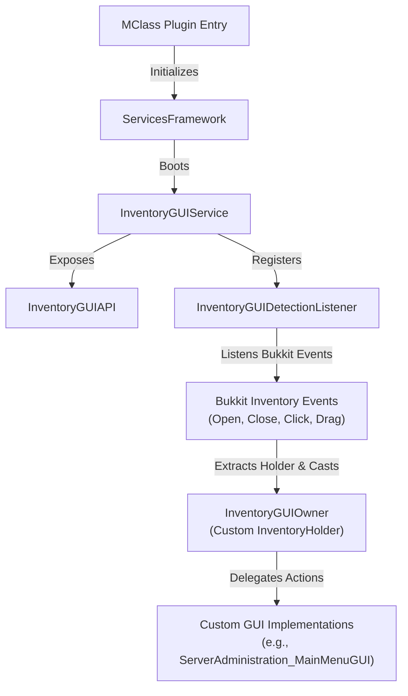

# Inventory GUI Service Module (InventoryGUIService)

## 📌 Code Path
* **Directory:** `src/main/kotlin/site/ftka/survivalcore/services/inventorygui/`
* **API Entry:** [InventoryGUIAPI.kt](file:///home/srleg/Projects/survivalcore/src/main/kotlin/site/ftka/survivalcore/services/inventorygui/InventoryGUIAPI.kt)
* **Core Service:** [InventoryGUIService.kt](file:///home/srleg/Projects/survivalcore/src/main/kotlin/site/ftka/survivalcore/services/inventorygui/InventoryGUIService.kt)

---

## 🎯 Main Purpose
An asynchronous, event-driven, memory-leak-free framework for spawning custom chest-based inventory interfaces, handling item slot interactions, blocking item manipulation exploits, and orchestrating clean configuration panel navigation across upper framework tiers.

---

## 🔗 Connections & Dependencies
* **Core Engine**: Hooks directly into the `ProprietaryEventsInitless` bus during initialization/reloads.
* **Bukkit Event System**: Listens to low-level inventory events (open, close, click, drag) and maps them dynamically.
* **Visual Interface Consumer (Tier 4)**: Inherited by `PermissionsManagerApp` and `ServerAdministrationApp` to generate interactive configuration menus and administration interfaces.

---

## 📊 System Architecture & Data Flow



### 🔁 Event Routing Lifecycle
1. **Creation**: Developers design a custom class implementing `InventoryGUIOwner`, which creates a Bukkit `Inventory` container passing the custom holder instance.
2. **Opening**: The player is presented with the inventory via `player.openInventory(gui.inventory)`.
3. **Interception**: Any interaction (clicking slots, dragging items, closing panels) is intercepted by `InventoryGUIDetectionListener`.
4. **Direct Casting & Dispatch**: The listener extracts the `InventoryHolder` and casts it to `InventoryGUIOwner` directly. If matches, the listener fires the respective event callback on the owner.
5. **Boilerplate Reduction**: Thanks to empty default implementations `{}` in the `InventoryGUIOwner` interface, developers only write code for the callbacks they care about.
6. **Automatic Cleanup**: When the player closes the inventory, the container and custom holder are naturally garbage collected. There are no static registries or global maps tracking them, ensuring **zero memory leaks**.

---

## 🛠️ Key Technical Enhancements

During our exhaustive audit of the `InventoryGUI` module, we resolved critical architectural limitations and bugs:

| Feature/Fix | Before Refactoring | After Refactoring (Current State) | Rationale & Impact |
| :--- | :--- | :--- | :--- |
| **Inventory Instantiation** | `Bukkit.createInventory` was called twice, discarding the first instance. | Created exactly once and returned directly. | Fixed a waste of resources and garbage creation during inventory initialization. |
| **Instance Tracking** | Registered globally in `inventoryOwnersMap` map and retrieved by `ownerName`. | Resolved dynamically via direct `as? InventoryGUIOwner` cast of `inventory.holder`. | **Resolved severe Memory Leak** (maps retained closed GUIs forever) and **Race Conditions/Collisions** (multiple players opening the same GUI type overwrote each other's references). |
| **Inventory Sizing** | Hard-locked to generic constraints of `InventoryType`. | Support custom integer sizes (multiples of 9 up to 54 slots). | Allows building custom chest layouts with flexible row counts (1 to 6 rows). |
| **Boilerplate overhead** | Empty declarations required for all callbacks. | Default method bodies `{}` declared in interface. | Drastically improves code readability and speed of developing new interfaces. |
| **Exploit Prevention** | Tracked only click events (`InventoryClickEvent`). | Integrates `InventoryDragEvent` handling. | Blocked drag-item-sharing exploits where smart players could duplicate/steal icons. |

---

## 💻 Integration & Developer Guide

### Step 1: Create Your GUI Class
Implement `InventoryGUIOwner` and block standard items manipulation to secure your GUI items:

```kotlin
package site.ftka.survivalcore.apps.ServerAdministration.gui

import net.kyori.adventure.text.Component
import net.kyori.adventure.text.format.NamedTextColor
import org.bukkit.Material
import org.bukkit.entity.Player
import org.bukkit.event.inventory.InventoryClickEvent
import org.bukkit.event.inventory.InventoryDragEvent
import org.bukkit.inventory.Inventory
import org.bukkit.inventory.ItemStack
import site.ftka.survivalcore.MClass
import site.ftka.survivalcore.services.inventorygui.interfaces.InventoryGUIOwner

class ServerAdministration_MainMenuGUI(
    private val plugin: MClass, 
    private val player: Player
) : InventoryGUIOwner {

    override val ownerName = "ServerAdminMainMenu_${player.uniqueId}"
    private val inv: Inventory = plugin.servicesFwk.inventoryGUI.api.createInventory(this, 27, Component.text("Server Panel"))

    init {
        setupItems()
    }

    private fun setupItems() {
        val reloadButton = ItemStack(Material.REDSTONE_BLOCK).apply {
            itemMeta = itemMeta?.apply {
                displayName(Component.text("Reload Services").color(NamedTextColor.RED))
            }
        }
        inv.setItem(13, reloadButton)
    }

    override fun getInventory(): Inventory = inv

    override fun clickEvent(event: InventoryClickEvent) {
        val clickedInv = event.clickedInventory ?: return
        if (clickedInv == inv) {
            event.isCancelled = true // Lock the GUI items so they cannot be taken!
            
            if (event.slot == 13) {
                player.closeInventory()
                player.sendMessage(Component.text("Reloading core services..."))
                plugin.servicesFwk.restartAll()
            }
        }
    }

    override fun dragEvent(event: InventoryDragEvent) {
        if (event.rawSlots.any { it < inv.size }) {
            event.isCancelled = true // Block drag exploits inside GUI
        }
    }
}
```

### Step 2: Open GUI for Player
```kotlin
val gui = ServerAdministration_MainMenuGUI(plugin, player)
player.openInventory(gui.inventory)
```